# Bản beta

_<mark style="color:$warning;">**Lưu ý: Bản beta chưa được code đầy đủ các tính năng**</mark>_

## Giao diện chung

<figure>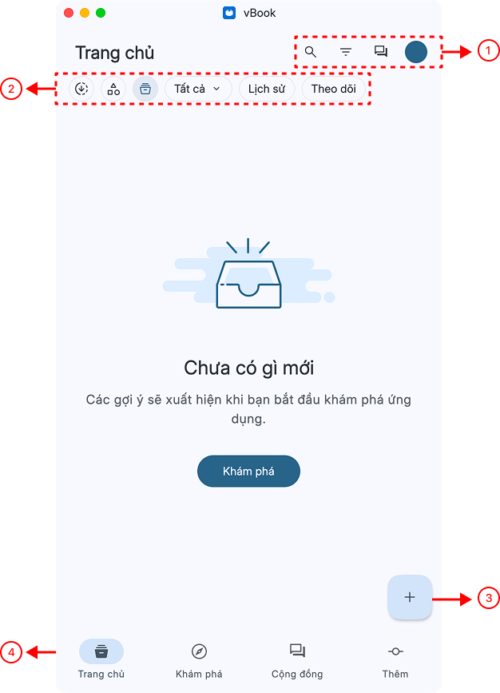<figcaption>
Ảnh 1
</figcaption></figure>

1. <mark style="color:$primary;">**Từ trái qua phải:**</mark>
   1. Tìm kiếm truyện
   2. Bộ lọc: Sắp xếp và hiển thị truyện (Ảnh 2)
   3. Chat: Tham gia vào nhóm chat chung trong app
   4. Avatar: Bấm vào có thể chọn Đăng ký, Đăng nhập, Chat , Đăng xuất
2. <mark style="color:$primary;">**Từ trái qua phải:**</mark>
   1. Danh sách truyện đang/đã tải
   2. Thư viện phân loại truyện theo danh mục do user tạo: ví dụ Ngôn tình, Huyền huyễn,... (Ảnh 4)\
      &#xNAN;_<mark style="color:$warning;">Lưu ý: Cần phải tạo danh sách danh mục trước thì mới có thể thêm truyện vào</mark>_
   3. Tất cả: Kệ sách chính, được phân chia truyện theo thể loại nguồn mặc định của vbook: Truyện tranh, truyện chữ, E-book (Ảnh 5)
   4. Lịch sử: danh sách truyện đã đọc
   5. Theo dõi: Danh sách truyện đã nhấn theo dõi (tiến độ cập nhật chương của tác giả)
3. <mark style="color:$primary;">**Nhập truyện: (Ảnh 3)**</mark>
   1. Nhập từ file: các định dạng hỗ trợ xem trong hình
   2. Nhập từ URL và từ trình duyệt: chỉ hỗ trợ các trang đã có ext
4. <mark style="color:$primary;">**Menu chính**</mark>
   1. Tranh chủ
   2. Khám phá: tương tự như việc duyệt web truyện trong vbook
   3. Cộng đồng: Chia sẻ review truyện, Nhóm chat chung, Thảo luận hỏi đáp, Báo lỗi
   4. Thêm: Các cài đặt của app

<figure>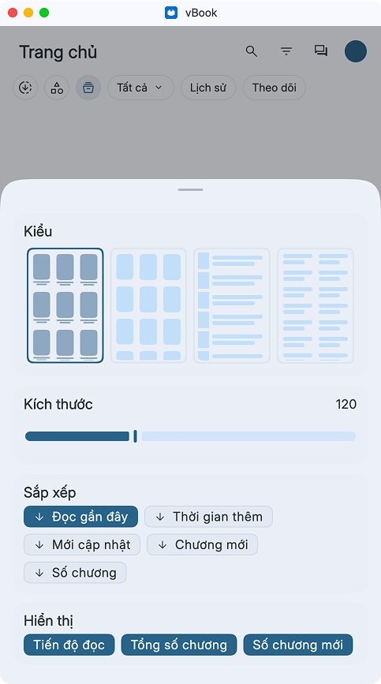<figcaption>
Ảnh 2
</figcaption></figure> <figure>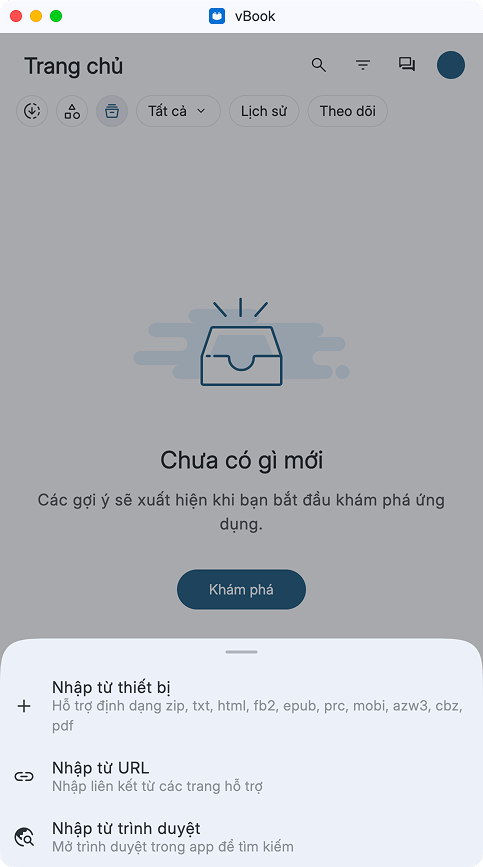<figcaption>
Ảnh 3
</figcaption></figure>

<figure>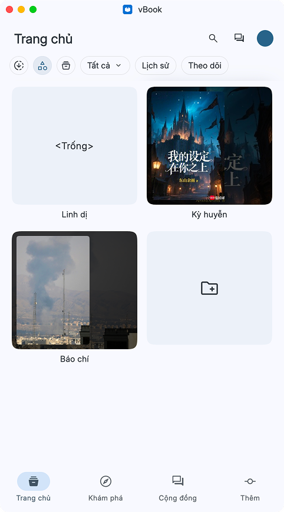<figcaption>
Ảnh 4
</figcaption></figure> <figure>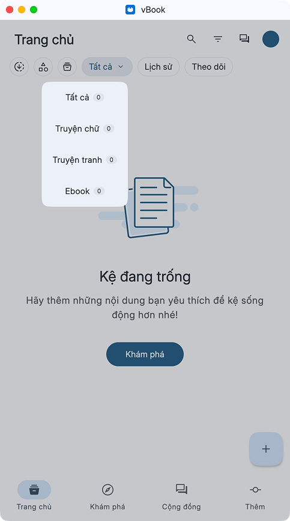<figcaption>
Ảnh 5
</figcaption></figure>

<figure>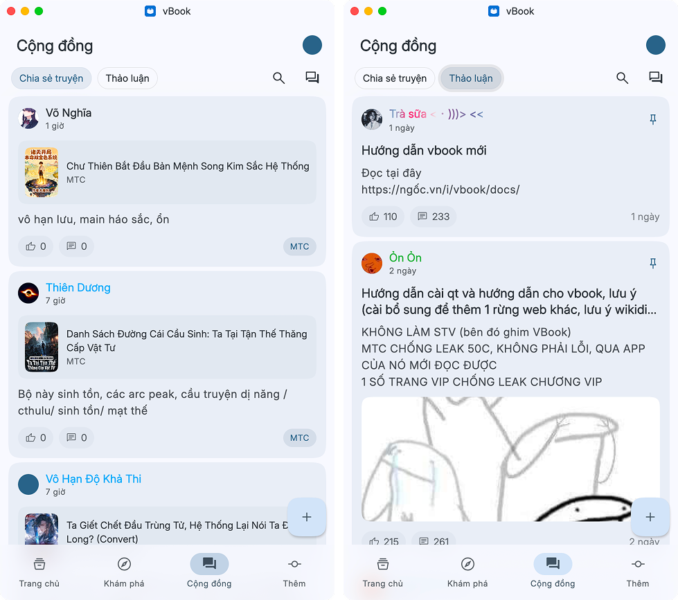<figcaption></figcaption></figure>

## Chỉnh sửa thông tin truyện

Nhấn giữ truyện muốn sửa

<figure>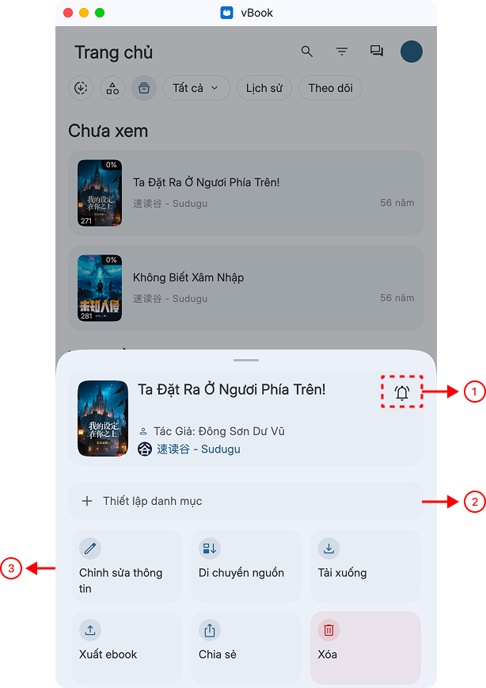<figcaption></figcaption></figure> <figure>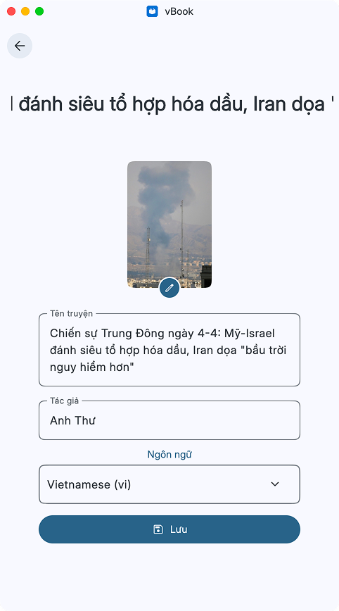<figcaption></figcaption></figure>

1. Nhấn theo dõi truyện
2. Thêm truyện vào danh mục đã tạo từ Ảnh 4
3. Chỉnh sửa thông tin khác của truyện

## Cài đặt

<figure><figcaption></figcaption></figure>

1. Cá nhân hóa: chỉnh sửa giao diện app [(Link)](ban-beta.md#cai-dat-doc-truyen)
2. Ngôn ngữ: chỉnh sửa ngôn ngữ app
3. Đọc truyện: các cài đặt liên quan đến việc đọc truyện [(Link)](ban-beta.md#cai-dat-doc-truyen)
4. Thông báo: nhận thông báo liên quan đến chat, truyện được cập nhật chương mới... [(Link)](ban-beta.md#thong-bao-va-thong-ke)
5. Thống kê: thống kê thời gian đọc truyện và dung lượng bộ nhớ bị chiếm dụng [(Link)](ban-beta.md#thong-bao-va-thong-ke)
6. Phần mở rộng: [Hướng dẫn](/broken/pages/sTOWG5UWCw2bZgLuya40)
7. Đồng bộ và Sao lưu [(Link)](ban-beta.md#sao-luu-va-dong-bo)
8. Trợ giúp
9. Phản hồi
10. Phiên bản app

### Cài đặt giao diện

<figure>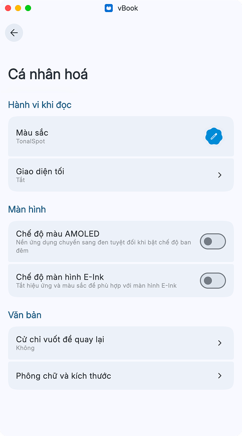<figcaption></figcaption></figure>

### Cài đặt đọc truyện

<figure>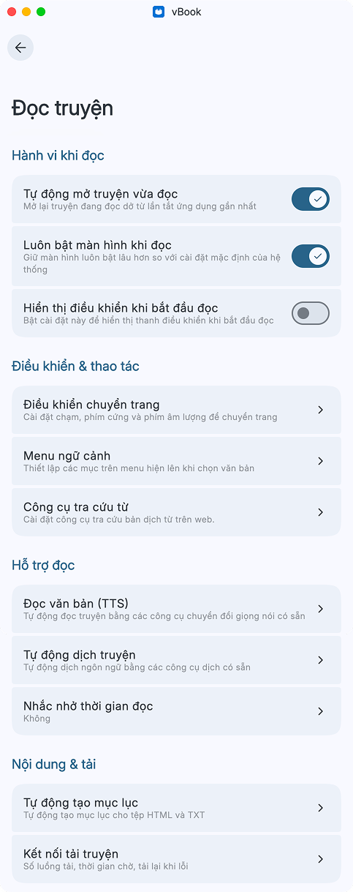<figcaption>
Toàn bộ cài đặt của phần đọc truyện
</figcaption></figure>

<figure>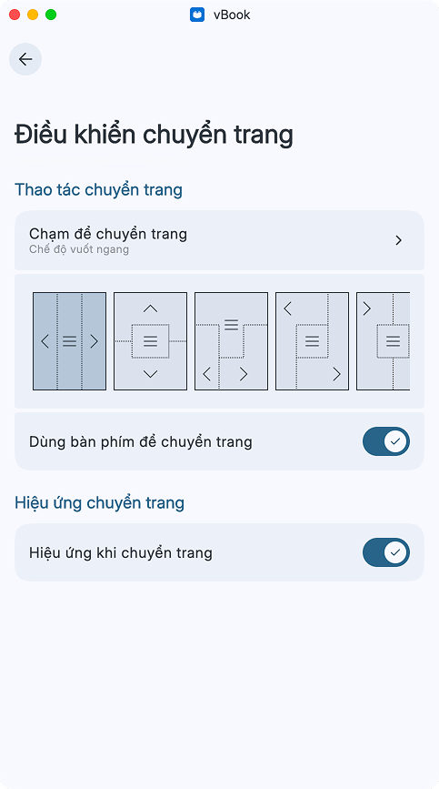<figcaption>
Các cài đặt của phần điều khiển chuyển trang
</figcaption></figure> <figure><figcaption>
Menu ngữ cảnh
</figcaption></figure>

#### Công cụ tra cứu từ <mark style="background-color:yellow;">trong phần cài đặt đọc truyện</mark>

<figure>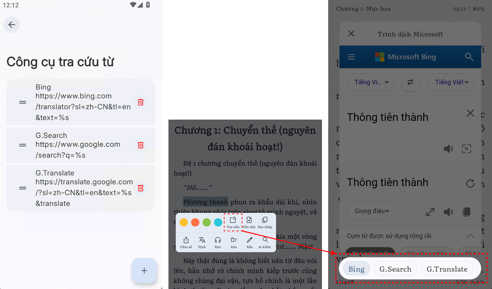<figcaption>
Công cụ tra cứu từ trong phần cài đặt đọc truyện và cách nó hiển thị trong app
</figcaption></figure>

#### Nghe truyện (Text-to-speech)

<figure>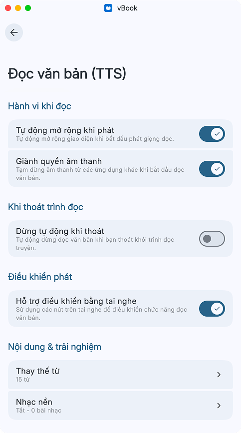<figcaption></figcaption></figure>

[<mark style="color:$primary;">**Các vấn đề liên quan đến TTS**</mark>](../nghe-truyen/nghe-truyen-tts.md)

#### Tự động dịch truyện

Dành cho ngôn ngữ không phải tiếng Việt

<figure><figcaption>
Các cài đặt trong phần dịch truyện
</figcaption></figure>

[<mark style="color:$primary;">**Các vấn đề và cài đặt liên quan đến dịch truyện**</mark>](../truyen-chu/truyen-dich.md)

#### Kết nối tải truyện

Tốc độ tải truyện chung

<figure>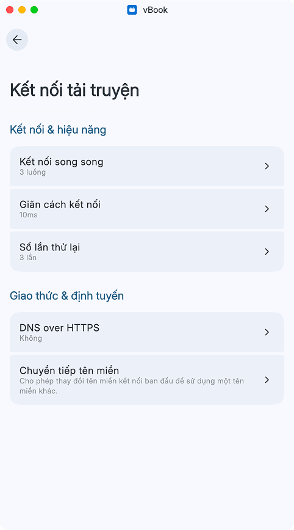<figcaption></figcaption></figure>

#### Chuyển tiếp tên miền

Đổi tên miền mới: dành cho những trang web chỉ đổi tên miền nhưng không thay đổi cấu trúc web. Nhập tên miền cũ ở ô trên và tên miền mới ở ô dưới

<figure>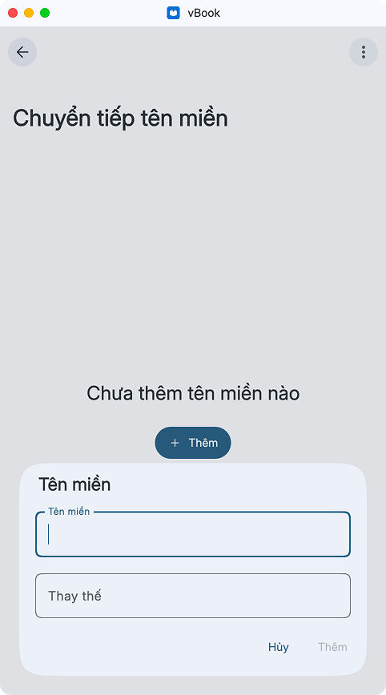<figcaption></figcaption></figure>

### Phần mở rộng

Cần cài đặt nguồn, sau đó cài đặt ext mới có thể đọc truyện trên vbook được

### Thông báo và thống kê

<figure>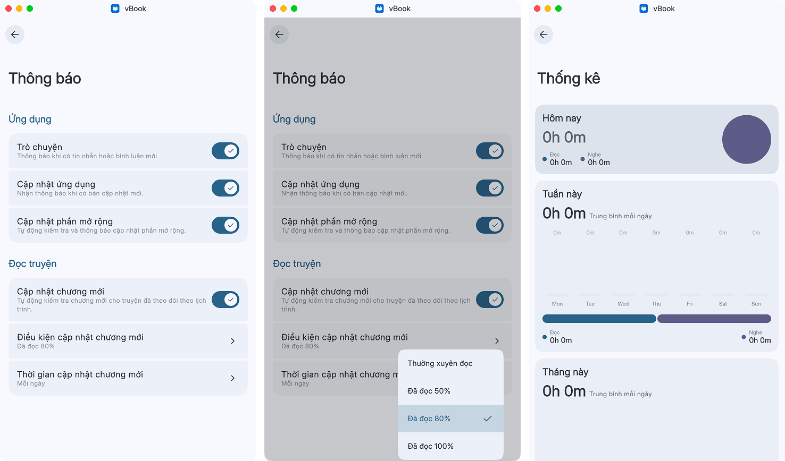<figcaption></figcaption></figure>

### Sao lưu và đồng bộ

Quá trình này sẽ sao lưu và phục hồi toàn bộ dữ liệu của app (tiến trình đọc, truyện đã tải, ext đã cài qua file zip và qua nguồn, dữ liệu vietphrase chung và riêng, cài đặt app) nhưng <mark style="color:$danger;background-color:yellow;">không bao gồm dữ liệu từ điển và danh sách các repo nguồn</mark>

<figure>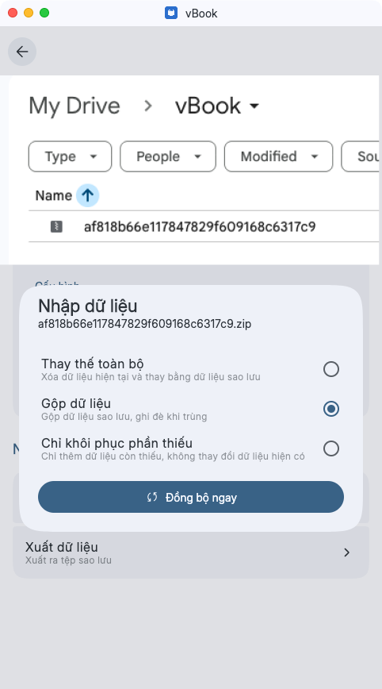<figcaption></figcaption></figure> <figure>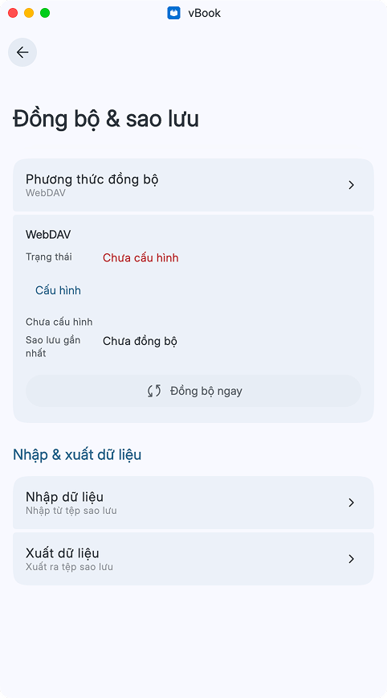<figcaption></figcaption></figure>

### Chế độ nhà phát triển

Dành cho dev

<figure>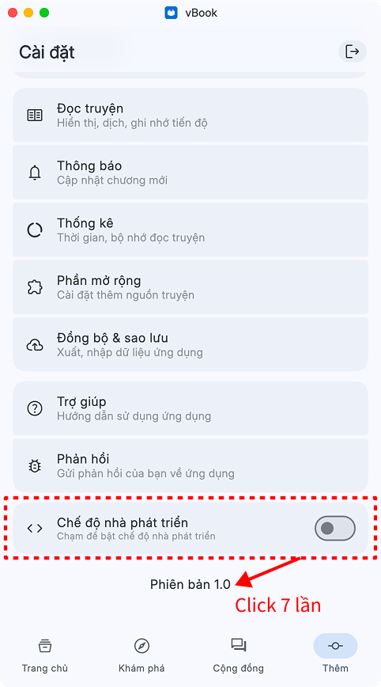<figcaption></figcaption></figure>
