# Giao diện app

## Video giới thiệu

{% embed url="https://files.gitbook.com/v0/b/gitbook-x-prod.appspot.com/o/spaces%2FwIrVteEIDLZ8Ul4z69Rr%2Fuploads%2F0qSxteJvuxaWimtcDL8U%2F0501.mp4?alt=media&token=36494b04-c614-4c5d-bb31-dbbbd83e19e0" %}

<figure>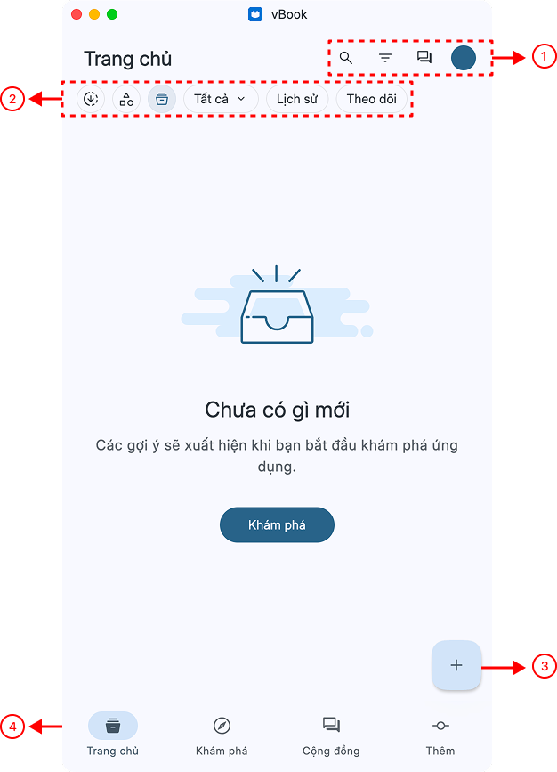<figcaption><p>Ảnh 1</p></figcaption></figure>

1. <mark style="color:$primary;">**Từ trái qua phải:**</mark>
   1. Tìm kiếm truyện
   2. Bộ lọc: Sắp xếp và hiển thị truyện (Ảnh 2)
   3. Chat: Tham gia vào nhóm chat chung trong app
   4. Avatar: Bấm vào có thể chọn Đăng ký, Đăng nhập, Chat , Đăng xuất
2. <mark style="color:$primary;">**Từ trái qua phải:**</mark>
   1. Danh sách truyện đang/đã tải
   2. Thư viện phân loại truyện theo danh mục do user tạo: ví dụ Ngôn tình, Huyền huyễn,... (Ảnh 4)\
      _<mark style="color:$warning;">Lưu ý: Cần phải tạo danh sách danh mục trước thì mới có thể thêm truyện vào</mark>_
   3. Tất cả: Kệ sách chính, được phân chia truyện theo thể loại nguồn mặc định của vbook: Truyện tranh, truyện chữ, E-book (Ảnh 5)
   4. Lịch sử: danh sách truyện đã đọc
   5. Theo dõi: Danh sách truyện đã nhấn theo dõi (tiến độ cập nhật chương của tác giả)
3. <mark style="color:$primary;">**Nhập truyện: (Ảnh 3)**</mark>
   1. Nhập từ file: các định dạng hỗ trợ xem trong hình
   2. Nhập từ URL và từ trình duyệt: chỉ hỗ trợ các trang đã có ext
4. <mark style="color:$primary;">**Menu chính**</mark>
   1. Tranh chủ
   2. Khám phá: tương tự như việc duyệt web truyện trong vbook
   3. Cộng đồng: Chia sẻ review truyện, Nhóm chat chung, Thảo luận hỏi đáp, Báo lỗi
   4. Thêm: Các cài đặt của app

<div><figure>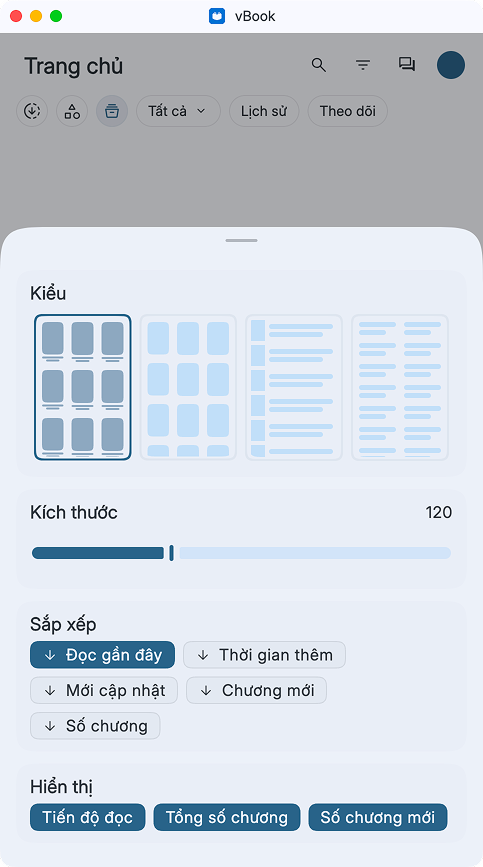<figcaption><p>Ảnh 2</p></figcaption></figure> <figure>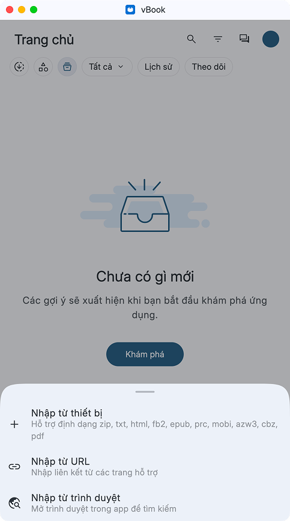<figcaption><p>Ảnh 3</p></figcaption></figure></div>

<div><figure>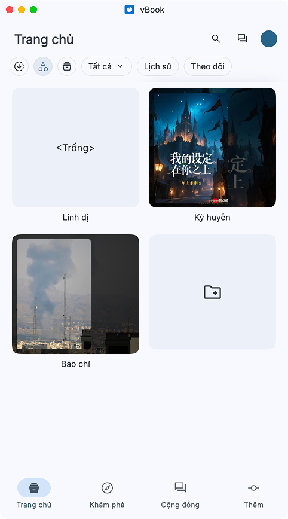<figcaption><p>Ảnh 4</p></figcaption></figure> <figure>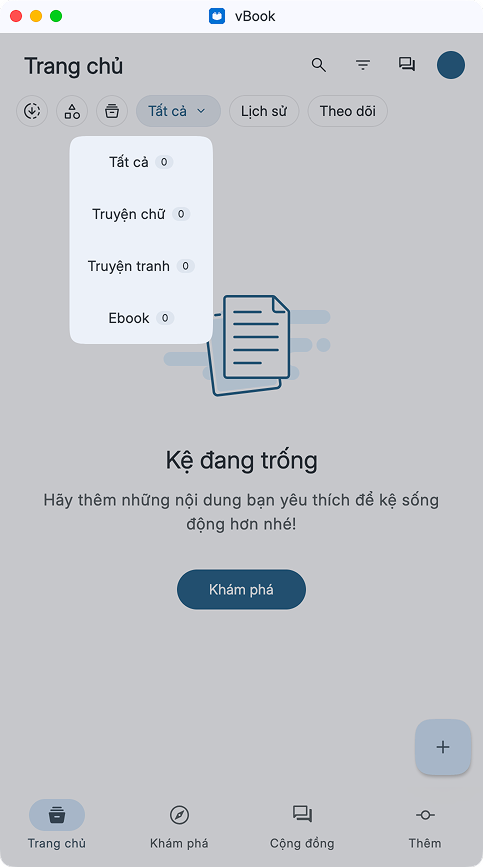<figcaption><p>Ảnh 5</p></figcaption></figure></div>

<figure>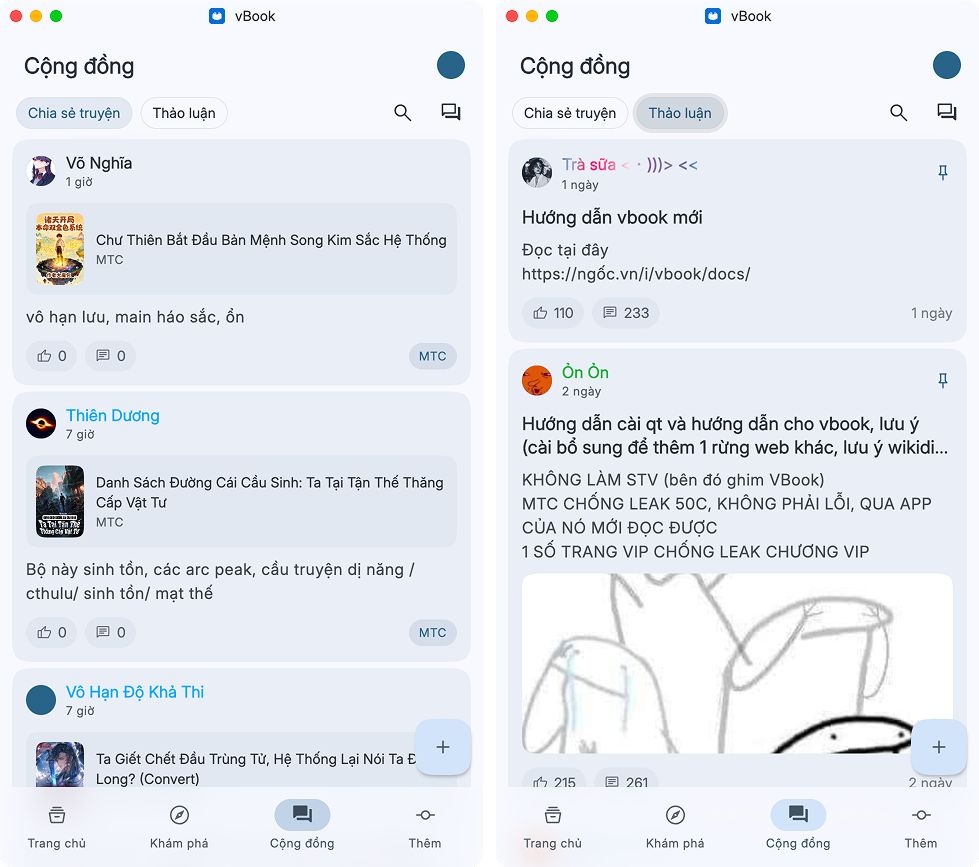<figcaption></figcaption></figure>

## Chỉnh sửa thông tin truyện

Nhấn giữ truyện muốn sửa

<div><figure>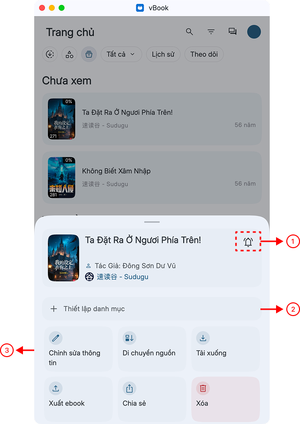<figcaption></figcaption></figure> <figure>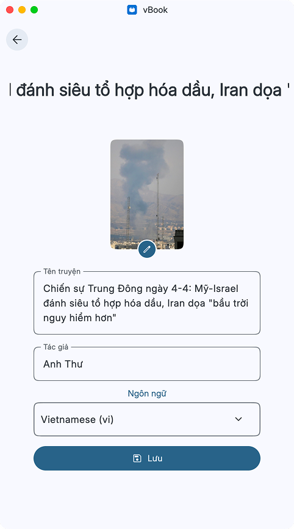<figcaption></figcaption></figure></div>

1. Nhấn theo dõi truyện
2. Thêm truyện vào danh mục đã tạo từ Ảnh 4
3. Chỉnh sửa thông tin khác của truyện

## Cài đặt

<figure><figcaption></figcaption></figure>

1. Cá nhân hóa: chỉnh sửa giao diện app [(Link)](ban-beta.md#cai-dat-doc-truyen)
2. Ngôn ngữ: chỉnh sửa ngôn ngữ app
3. Đọc truyện: các cài đặt liên quan đến việc đọc truyện [(Link)](ban-beta.md#cai-dat-doc-truyen)
4. Thông báo: nhận thông báo liên quan đến chat, truyện được cập nhật chương mới... [(Link)](ban-beta.md#thong-bao-va-thong-ke)
5. Thống kê: thống kê thời gian đọc truyện và dung lượng bộ nhớ bị chiếm dụng [(Link)](ban-beta.md#thong-bao-va-thong-ke)
6. Phần mở rộng: [Hướng dẫn](https://app.gitbook.com/s/wIrVteEIDLZ8Ul4z69Rr/nguon-mo-rong)
7. Đồng bộ và Sao lưu [(Link)](ban-beta.md#sao-luu-va-dong-bo)
8. Trợ giúp
9. Phản hồi
10. Phiên bản app

### Cài đặt giao diện

<figure>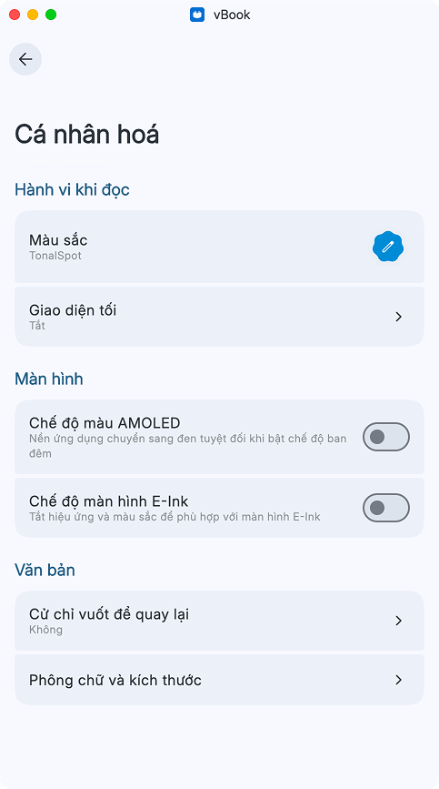<figcaption></figcaption></figure>

### Cài đặt đọc truyện

<figure>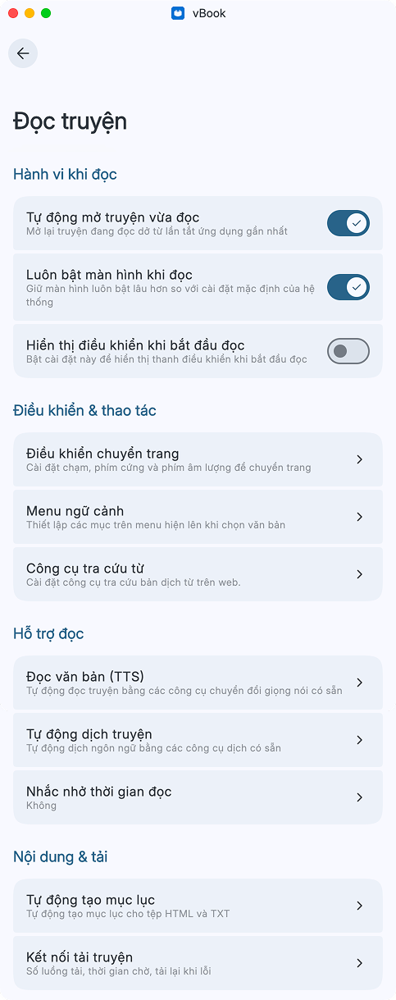<figcaption><p>Toàn bộ cài đặt của phần đọc truyện</p></figcaption></figure>

<div><figure>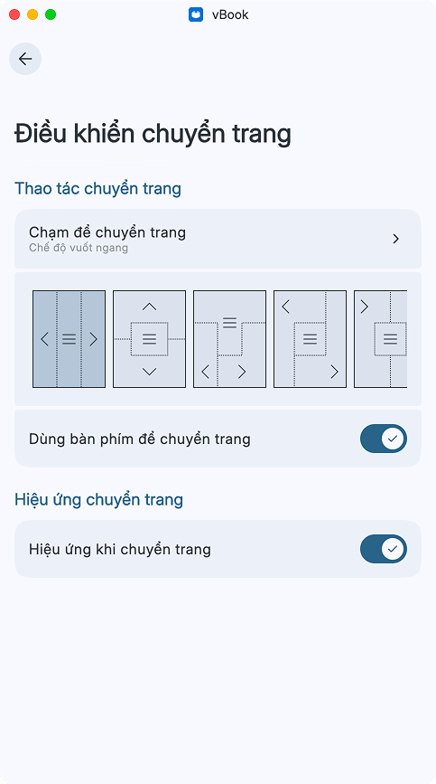<figcaption><p>Các cài đặt của phần điều khiển chuyển trang</p></figcaption></figure> <figure><figcaption><p>Menu ngữ cảnh</p></figcaption></figure></div>

#### Công cụ tra cứu từ <mark style="background-color:yellow;">trong phần cài đặt đọc truyện</mark>

<figure>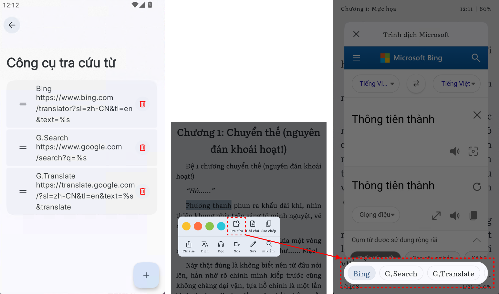<figcaption><p>Công cụ tra cứu từ trong phần cài đặt đọc truyện và cách nó hiển thị trong app</p></figcaption></figure>

### Nghe truyện (Text-to-speech)

<figure>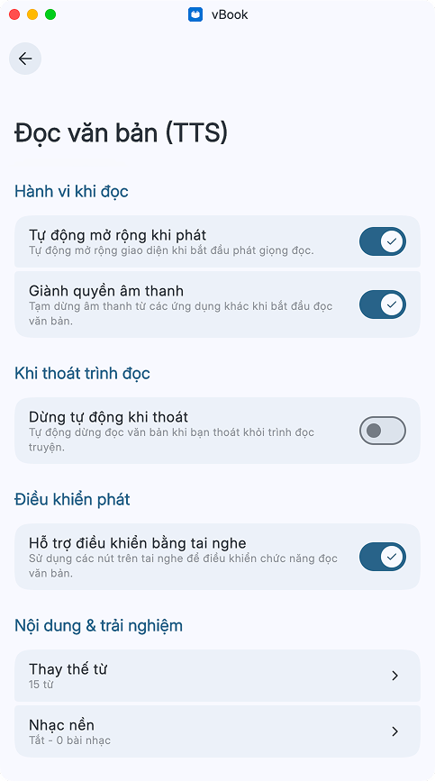<figcaption></figcaption></figure>

[<mark style="color:$primary;">**Các vấn đề liên quan đến TTS**</mark>](../nghe-truyen/nghe-truyen-tts.md)

### Tự động dịch truyện

Dành cho ngôn ngữ không phải tiếng Việt

<figure><figcaption><p>Các cài đặt trong phần dịch truyện</p></figcaption></figure>

[<mark style="color:$primary;">**Các vấn đề và cài đặt liên quan đến dịch truyện**</mark>](../truyen-chu/truyen-dich.md)

### Kết nối tải truyện

Tốc độ tải truyện chung

<figure>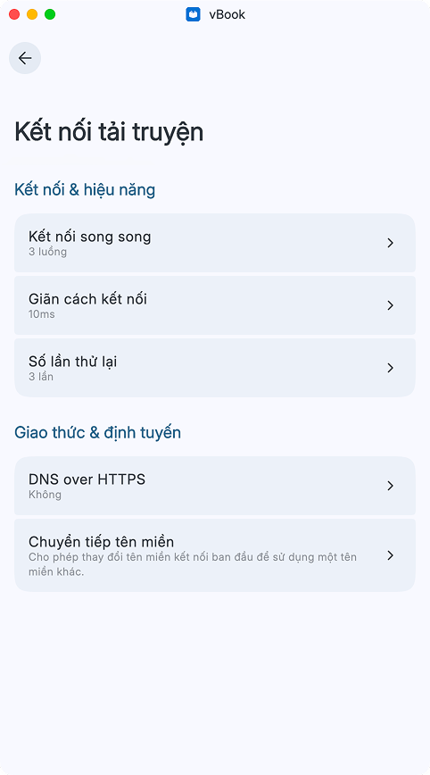<figcaption></figcaption></figure>

### Chuyển tiếp tên miền

Đổi tên miền mới: dành cho những trang web chỉ đổi tên miền nhưng không thay đổi cấu trúc web. Nhập tên miền cũ ở ô trên và tên miền mới ở ô dưới

<figure>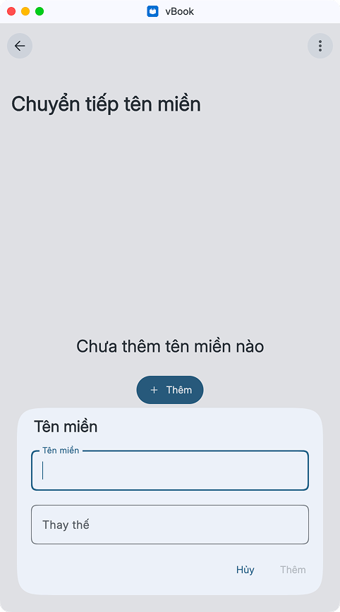<figcaption></figcaption></figure>

### Phần mở rộng

Cần cài đặt nguồn, sau đó cài đặt ext mới có thể đọc truyện trên vbook được

<a href="https://app.gitbook.com/s/wIrVteEIDLZ8Ul4z69Rr/nguon-mo-rong" class="button primary">Danh sách nguồn</a>

### Thông báo và thống kê

<figure>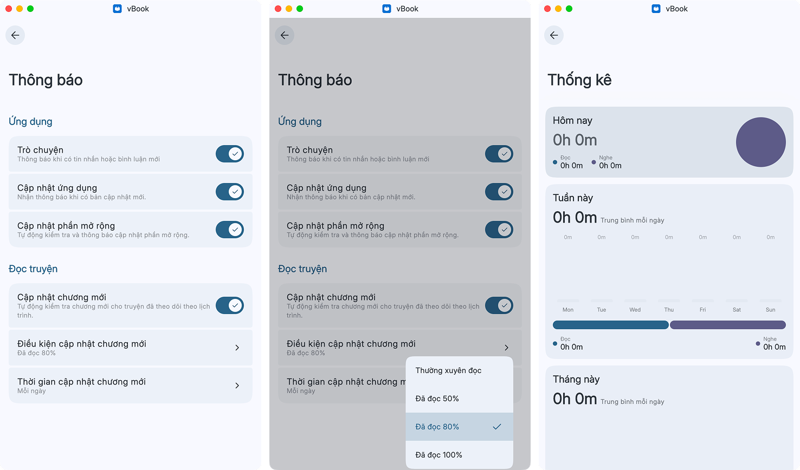<figcaption></figcaption></figure>

### Sao lưu và đồng bộ

#### Nhập dữ liệu từ vbook bản thường qua vbook bản beta

Quá trình này sẽ sao lưu và phục hồi toàn bộ dữ liệu của app (tiến trình đọc, danh sách truyện trong kệ sách, ext đã cài qua file zip và qua nguồn, dữ liệu vietphrase chung và riêng) nhưng <mark style="color:$danger;background-color:yellow;">không bao gồm dữ liệu từ điển, nội dung truyện đã tải, truyện nhập qua file và danh sách các repo nguồn</mark>

1. Đồng bộ dữ liệu bản thường lên Drive
2. Lên Drive vào thư mục vBook, **tải bản zip vừa đồng bộ về điện thoại**
3. Mở bản beta lên, vào mục **Đồng bộ và Sao lưu > Nhập và xuất dữ liệu,** chọn **Nhập dữ liệu**, nhập file zip vừa tải về.

<div><figure>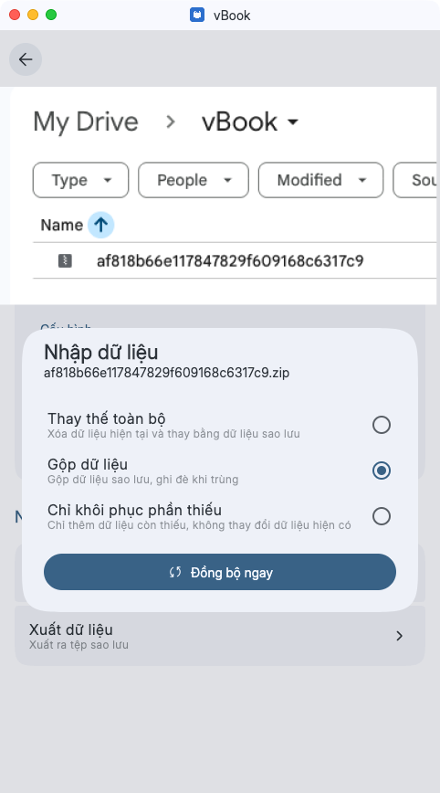<figcaption></figcaption></figure> <figure>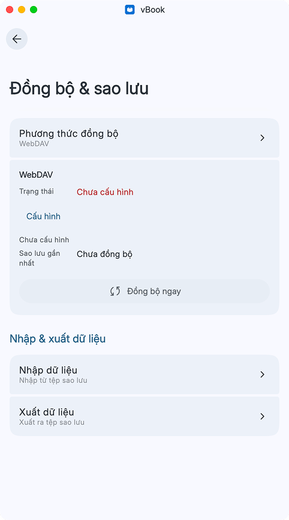<figcaption></figcaption></figure></div>

#### Sao lưu và Đồng bộ giữa nhiều thiết bị <mark style="color:$danger;">(bản beta)</mark>

#### 1. Google Drive

* Phương thức đồng bộ: Chọn Google Drive
* Chọn Đăng nhập

<figure>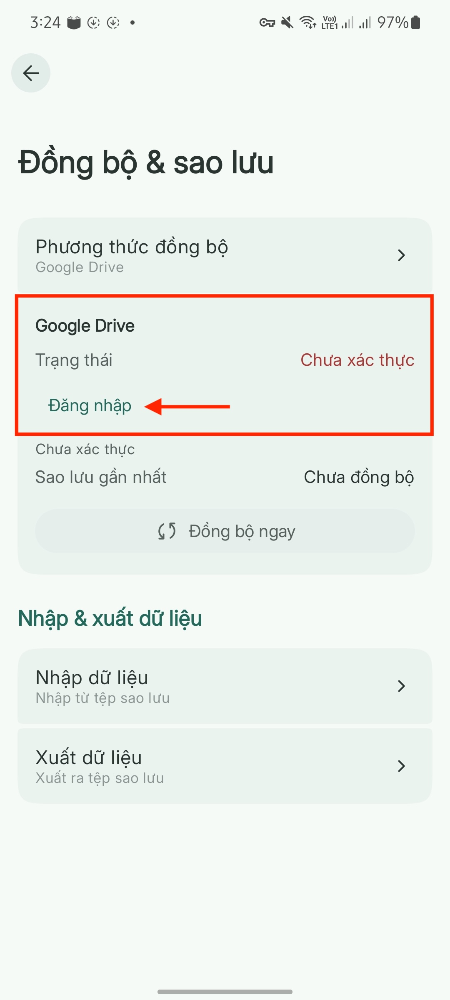<figcaption></figcaption></figure>

#### 2. Web Dav



### Yêu cầu chuẩn bị:&#x20;

Bạn cần đăng ký một tài khoản Cloudflare



### Kích hoạt R2

1. Vào [https://dash.cloudflare.com/cde4cec05bc9e288705067620b6a7fcf/r2/plans](https://dash.cloudflare.com/cde4cec05bc9e288705067620b6a7fcf/r2/plans)
2.  Chọn <mark style="color:$primary;">**Add R2 subscription to my account**</mark> và điền các thông tin liên quan


    <figure><figcaption></figcaption></figure>



### Cấu hình Cloudflare

1.  Vào **Cloudflare Dashboard,** mục **R2** và **tạo một Bucket mới** (**ví dụ: vbook-backup-bucket)**: [https://dash.cloudflare.com/08a1ed706f082c8a00f1918888d0585b/r2/overview](https://dash.cloudflare.com/08a1ed706f082c8a00f1918888d0585b/r2/overview)


    <figure><figcaption></figcaption></figure>
2.  Vào **Workers & Pages > KV** và tạo một Namespace mới (ví dụ: USER\_KV). **Copy ID của Namespace đó.**\
    [https://dash.cloudflare.com/08a1ed706f082c8a00f1918888d0585b/workers/kv/namespaces](https://dash.cloudflare.com/08a1ed706f082c8a00f1918888d0585b/workers/kv/namespaces)


    <figure><figcaption></figcaption></figure>


    <figure><figcaption></figcaption></figure>



### Cài đặt dự án

* Cài Node


```
node -v
npm -v
```


* Cài Wrangler CLI


```
npm install -g wrangler
```


* Tải dự án về máy tính của bạn


```
git clone https://github.com/kychitoge/vbook-webdav.git
cd vbook-webdav
npm install
```




### Cấu hình Biến môi trường

Đổi tên file `wrangler.example.jsonc` thành `wrangler.jsonc` ở thư mục gốc và cập nhật thông tin của bạn

<figure><figcaption></figcaption></figure>



### Deploy lên Cloudflare


```
npx wrangler deploy
```




### Hướng Dẫn Sử Dụng

1. **Quản trị User (Dành cho Admin)**
   1. Truy cập đường dẫn bí mật: `https://<ten-worker>.<tài khoản cloudflare của bạn>.workers.dev/admin`
   2. Nhập mã PIN (Đã cài trong phần ADMIN\_PIN)
   3. Thêm Username mới, thiết lập Mật khẩu, Dung lượng tối đa (Quota MB), Kích thước file tối đa (Max File MB).
   4.  Bấm Edit để cập nhật thông số người dùng hiện tại (bỏ trống trường password để giữ nguyên mật khẩu cũ) hoặc Delete để xóa người dùng cùng toàn bộ file R2 của người dùng đó.


       <figure><figcaption></figcaption></figure>
2. **Cấu hình trên Ứng dụng VBook / Legado**
   1. Mở ứng dụng đọc truyện của bạn, vào phần **Đồng bộ & Sao lưu -> WebDAV**
   2. **URL / Địa chỉ:** `https://<ten-worker>.<tài khoản cloudflare của bạn>.workers.dev/` (Hoặc có thể thêm `/webdav` phía sau đều được hỗ trợ).
   3. **Tên đăng nhập (Username):** Username vừa tạo trong trang Admin.
   4. **Mật khẩu (Password):** Mật khẩu tương ứng vừa tạo trong trang Admin.
   5. **Thư mục gốc:&#x20;**<mark style="color:red;">**`vbook_backup`**</mark> (Khuyến nghị giữ nguyên để tạo thư mục đồng bộ riêng).
   6. Bấm **Kiểm tra** để xác thực kết nối (thấy chữ xanh báo thành công) và bấm **Lưu lại**!



### Giao diện Web Cá Nhân (Fake Cloud Drive)

* Mở trình duyệt truy cập thẳng: `https://<ten-worker>.<tài khoản cloudflare của bạn>.workers.dev/`
* Hệ thống sẽ hỏi thông tin đăng nhập **Basic Auth**.
* Nhập tài khoản người dùng WebDAV của bạn (đã tạo trong trang Admin).
* Bạn có thể xem trực quan danh sách file, kiểm tra dung lượng còn trống, tải file về máy hoặc xóa file cực kỳ thuận tiện.
* Có thể chia sẻ/dùng chung webdav bằng cách tạo new user.

<figure><figcaption></figcaption></figure>



### Lưu Ý Về Giới Hạn Vật Lý (Hạ Tầng Cloudflare)

Vì hệ thống vận hành trên kiến trúc Serverless miễn phí của Cloudflare, có một số giới hạn vật lý cần chú ý:

1. <mark style="color:$danger;">**Giới hạn dung lượng file tải lên tối đa là 100MB:**</mark> Cloudflare Workers giới hạn dung lượng request tối đa là **100MB**. Nếu bạn tải lên file đơn lẻ nặng hơn 100MB, Cloudflare Edge sẽ trả về lỗi <mark style="color:$danger;">`413 Request Entity Too Large`</mark> trước khi Worker kịp xử lý. Hãy thiết lập WebDAV client chia nhỏ file nếu bạn cần backup khối lượng dữ liệu khổng lồ.
2. **Đồng bộ KV (Eventual Consistency):** Workers KV có cơ chế đồng bộ phân tán toàn cầu với độ trễ từ 1-5 giây. Vì vậy, dung lượng lưu trữ trên trang Admin hoặc Web UI có thể mất vài giây để cập nhật chính xác số bytes sau khi bạn vừa tải một lượng lớn file lên.
3. **Bắt buộc sử dụng HTTPS:** Xác thực Basic Auth gửi mật khẩu dưới dạng chuỗi Base64. Luôn đảm bảo sử dụng đường dẫn `https://` (mặc định Cloudflare đã kích hoạt sẵn) để đảm bảo mật khẩu được truyền đi qua kênh mã hóa an toàn.



### Chế độ nhà phát triển

Dành cho dev

<figure>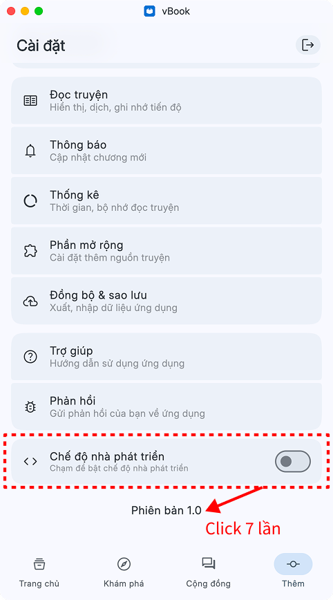<figcaption></figcaption></figure>
