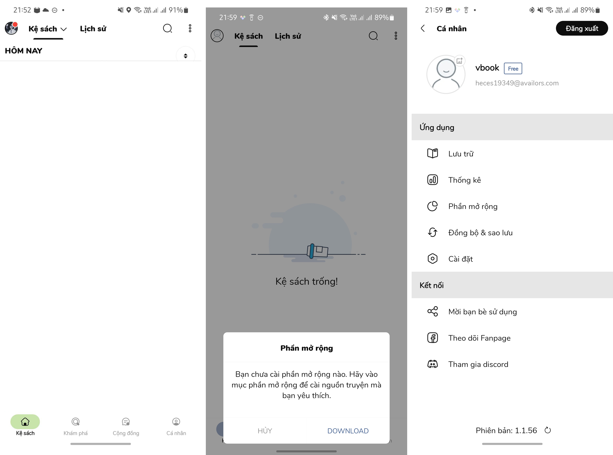
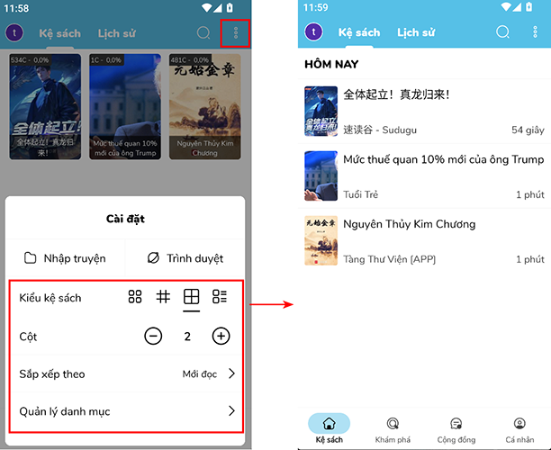
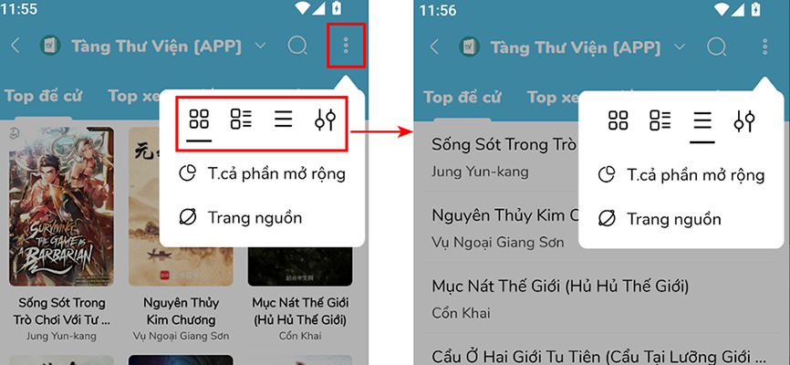

# Bản thường

## Giao diện chung

<figure><figcaption></figcaption></figure>

### Xuất ebook

* Yêu cầu tài khoản premium
* Tải truyện muốn xuất ebook về máy trước
* Nhấn giữ truyện để bật popup
* Chọn "Xuất ebook"

<figure><figcaption></figcaption></figure>

Thay đổi kiểu hiển thị truyện



<figure><figcaption></figcaption></figure>



<figure><figcaption></figcaption></figure>



### Xoá truyện




{% embed url="https://files.gitbook.com/v0/b/gitbook-x-prod.appspot.com/o/spaces%2FwIrVteEIDLZ8Ul4z69Rr%2Fuploads%2FsVyZ2wTO0MiYzFAOGba8%2Fxoa-truyen-1.mp4?alt=media&token=944935af-64d4-4ac7-9ae3-0984675b0c48" %}




{% embed url="https://files.gitbook.com/v0/b/gitbook-x-prod.appspot.com/o/spaces%2FwIrVteEIDLZ8Ul4z69Rr%2Fuploads%2F5ha0GzCDLba6vG7Ym9e1%2Fxoa-truyen-2.mp4?alt=media&token=b6025838-a834-4bf4-896b-12da98009ce7" %}



### Lưu trữ và phục hồi

{% embed url="https://files.gitbook.com/v0/b/gitbook-x-prod.appspot.com/o/spaces%2FwIrVteEIDLZ8Ul4z69Rr%2Fuploads%2F5xpaYUD8iWzzHtg5FZOv%2Fthaotac-2.mp4?alt=media&token=a031c07f-28fd-4903-bd0d-04b8446f6c0d" %}

