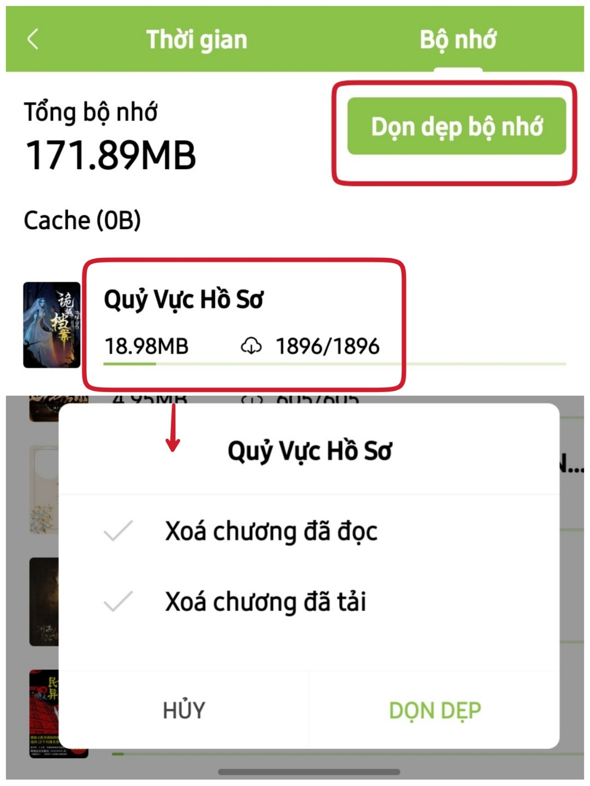

# Một số vấn đề khác

## Xóa cache/nội dung chương đã tải/đã đọc

Vào Cá nhân > Thống kê > Bộ nhớ : Bấm dọn dẹp bộ nhớ để xóa cache toàn kệ sách hoặc bấm vào từng truyện để xóa cache cho truyện mình chọn

<figure><figcaption></figcaption></figure>
