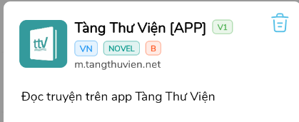
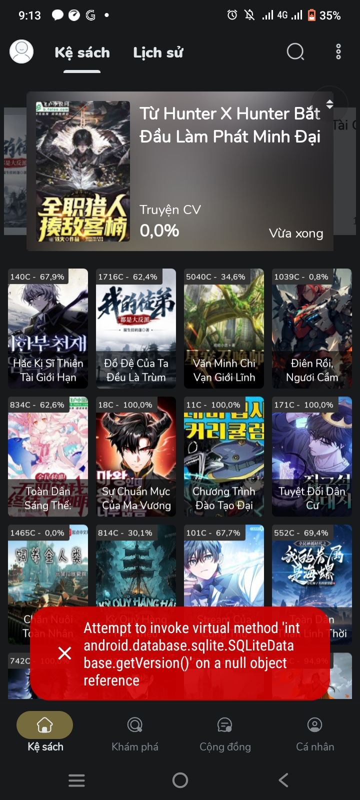
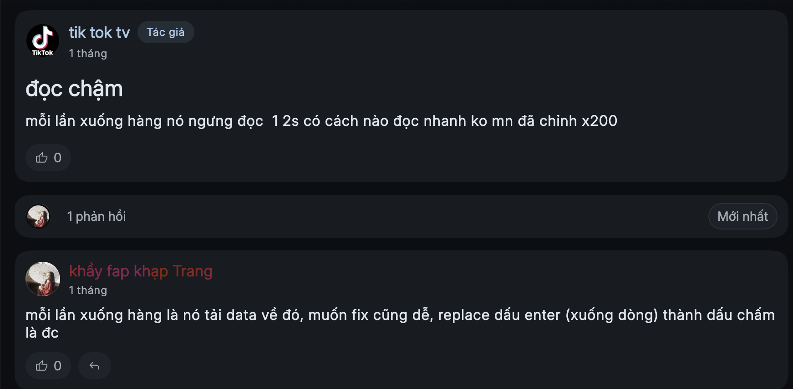

# Câu hỏi thường gặp

## SangTacViet (STV)

Không làm, không hỗ trợ!

## MeTruyenChu (MTC)

Còn đọc tốt.

## Truyện Fanqie

Đây là nguồn trả phí! Tôi có bán ext fanqie cho các cô nương xinh đẹp :D

Các nguồn Fanqie khác

**1. Noir**

Add nguồn này vào vbook rồi cài ext: `https://fanqie.1415918.xyz/source`

\===========================

Free: 55 requests / ngày.

50k vnd = 10k request ưu tiên / tháng (đọc bình thường + tải nhẹ thì thoải mái). 200k vnd = 50k request ưu tiên / tháng (phù hợp nếu cần tải nhiều).

Request ưu tiên sẽ không bị rate limit.

\===========================

**https://fanqie.1415918.xyz/usage**

**Discord:** [**Noir**](https://discord.com/users/364346855187808256)

\===========================

[**Hướng dẫn Fanqie dành cho user muốn tự host**](https://discord.com/channels/607084896288243731/1478715436785991711/1478715436785991711)

\===========================

**2. Chanhnh**

Chỉ dành cho bản beta: `https://raw.githubusercontent.com/Chanhnh/vbook-ext/main/plugin.json`

**3. Yange**

[**Link bài viết**](https://discord.com/channels/607084896288243731/1476830093996327097)

### Về Wikidich

<mark style="color:$danger;">**Không duyệt truyện trên Wikidich bằng vbook.**</mark>

Cụ thể là tất cả thao với với Wikidich phải thực hiện trên "Chrome", sau khi tìm được truyện, ấn nút "SHARE" vào app vBook sau đó ấn "TẢI", tải xong rồi muốn làm gì thì làm.

Làm mình làm mẩy bị ban acc vĩnh viễn.

<mark style="color:$warning;">**Tương tự cho các trang không thể tìm kiếm trên vbook**</mark>

[**Cách share từ trình duyệt**](mot-so-cai-dat-khac.md#them-truyen-tu-trinh-duyet)

## Về Wattpad

Tương tự như Wikidich, search trên browser và share về vbook.

Đây là ví dụ về cấu trúc link đúng mới có thể thêm vào kệ sách được

<mark style="color:$warning;">**`https://www.wattpad.com/story/`**</mark>**`322862013-my-note-fix-data-thuonglanghathanh`**

Nếu link không đúng thì bạn sẽ nhận được thông báo là **Trang này chưa được hỗ trợ**.

Link sai: <mark style="color:$danger;">**`https://www.wattpad.com/1610890289-`**</mark>**`l%C3%A3o-th%C3%A1i-xuy%C3%AAn-th%C6%B0-n%C4%83m-m%E1%BA%A5t-m%C3%B9a-ta-%C4%91i-hoa-l%E1%BB%99-ng%C6%B0%C6%A1i`**

## Về Tàng thư viện

Cài ext này để xem

<figure><figcaption></figcaption></figure>

## Lỗi không có dữ liệu, không đọc được truyện 

Hầu hết các trường hợp đều giải quyết được bằng cách **bật VPN**. Một vài app VPN free: Proton VPN, 1.1.1.1,...

Nếu vẫn bị lỗi, chụp ảnh lỗi, quay video lại, gửi kèm link truyện, tên truyện trong phần **Cộng đồng**.

## Các lỗi khác

<figure><figcaption></figcaption></figure>

Máy hết dung lượng, xoá bớt ảnh video đi.

<figure><figcaption></figcaption></figure>
