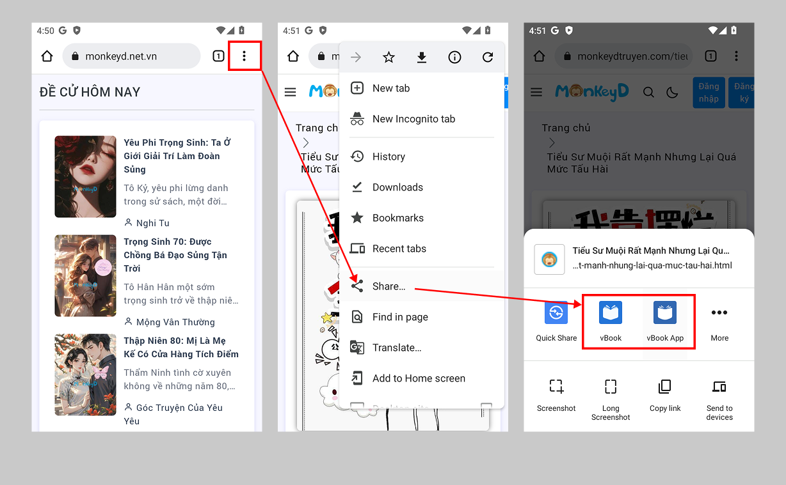
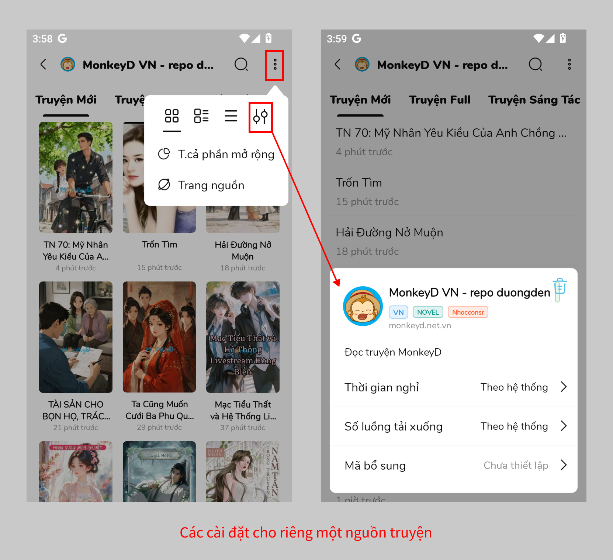
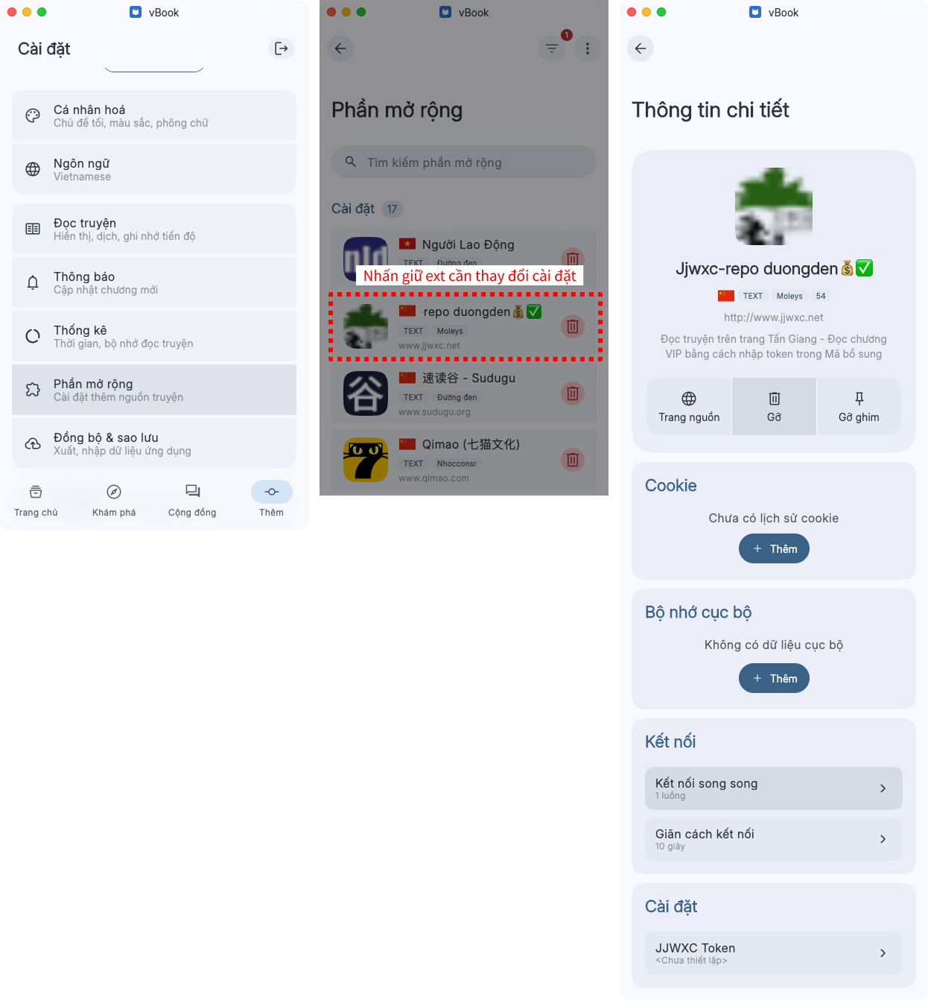

# Một số cài đặt khác

## Thêm truyện từ trình duyệt

<figure><figcaption></figcaption></figure>

## Thêm truyện từ trang nguồn

<figure><figcaption>
Bản thường
</figcaption></figure>

<figure><figcaption>
Bản beta
</figcaption></figure>

## Mở cài đặt riêng cho một nguồn

<figure><figcaption>
Bản thường
</figcaption></figure>

<figure><figcaption>
Bãn beta
</figcaption></figure>
