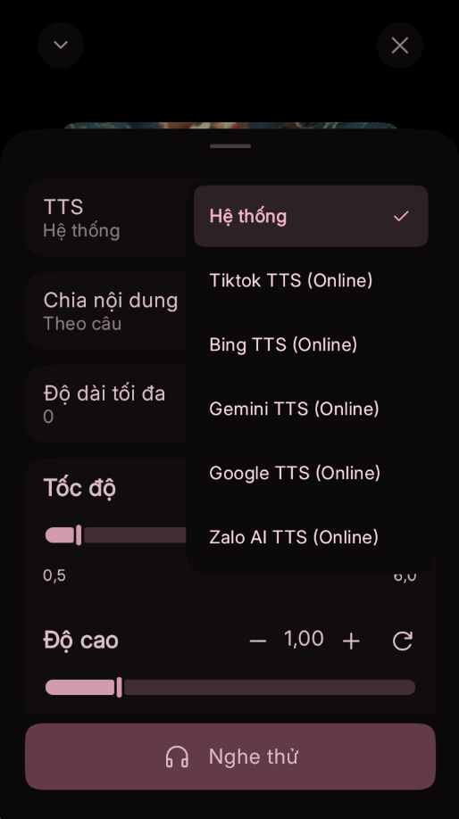
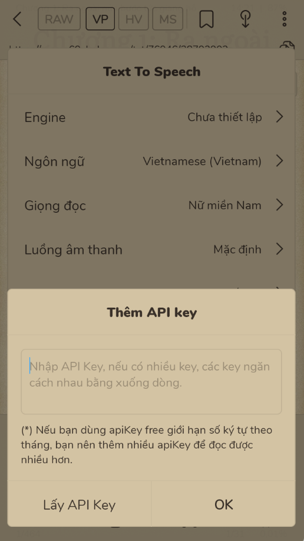
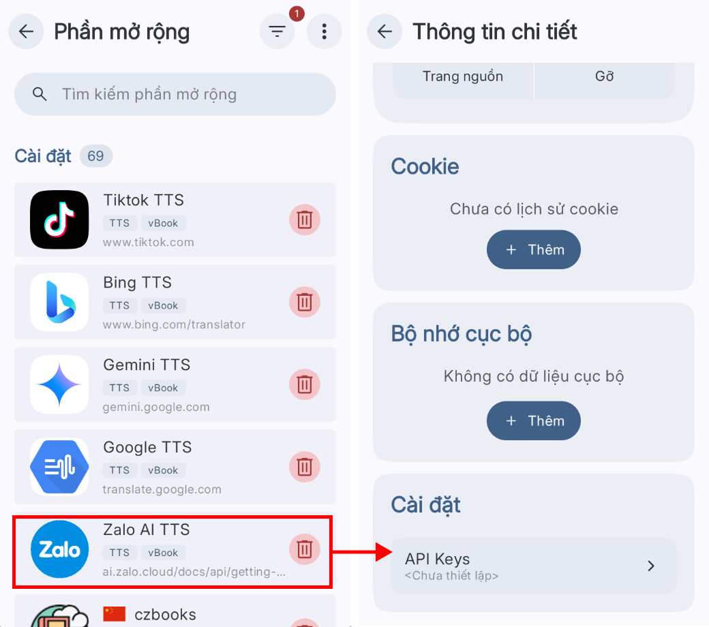

# Nghe truyện (TTS)

### Bản thường

<figure><figcaption></figcaption></figure>

<figure><figcaption></figcaption></figure>

#### Các loại TTS:

1. **Mặc định:** TTS của thiết bị, miễn phí, có thể sử dụng khi không có mạng
2. **Google TTS, Microsoft TTS, Tiktok TTS:** chỉ có thể sử dụng khi có mạng, miễn phí
3. **FPT TTS, Zalo TTS:** Trả phí, chỉ có thể sử dụng khi có mạng

### Bản beta

1. Cài extension TTS. **Nguồn: xem** <a href="../nguon-mo-rong/danh-sach-nguon.md" class="button primary">Danh sách nguồn</a>

<figure><figcaption></figcaption></figure>

#### Các loại TTS:

* **Hệ thống:** TTS của thiết bị, miễn phí, có thể sử dụng khi không có mạng
* **Google TTS, Bing TTS, Tiktok TTS, Gemini TTS:** chỉ có thể sử dụng khi có mạng, miễn phí
* **Zalo AI TTS:** Trả phí, chỉ có thể sử dụng khi có mạng

<figure><figcaption></figcaption></figure>

### Hướng dẫn lấy API key cho TTS trả phí


Ví dụ với TTS của Zalo, các TTS trả phí khác cũng tương tự


<figure><figcaption></figcaption></figure>

1. Đăng nhập [**https://ai.zalo.solutions/**](https://ai.zalo.solutions/) bằng tài khoản Zalo của bạn
2. Vào [**https://zalo.ai/account/manage-keys**](https://zalo.ai/account/manage-keys) để tạo và lấy key
3.

    <figure><figcaption></figcaption></figure>
4. Copy key bỏ vào ô API key

<figure><figcaption>
Bản thường
</figcaption></figure>

<figure><figcaption>
Bản beta
</figcaption></figure>

### Hướng dẫn dùng Tiktok TTS

<figure><figcaption></figcaption></figure>

<figure><figcaption></figcaption></figure>

<figure><figcaption></figcaption></figure>
