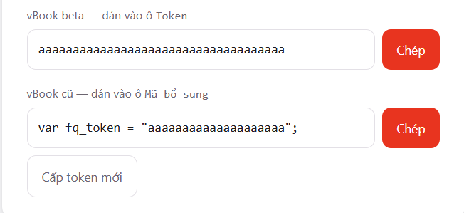
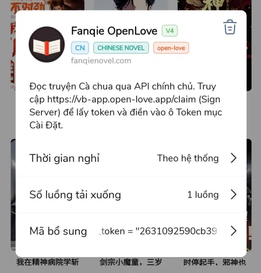
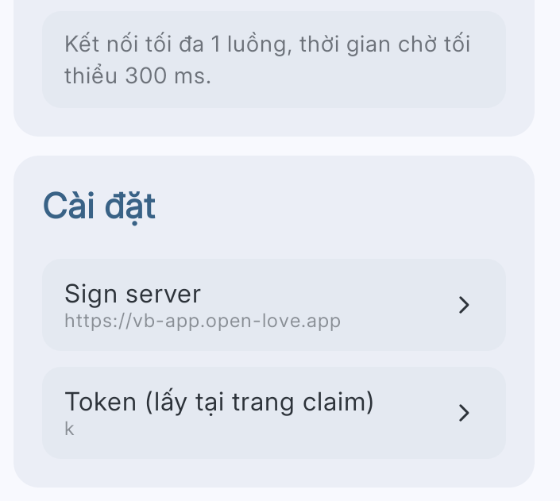

# Cà chua

## Free&#x20;

Ưu điểm: Free

Khuyết điểm: có thể chết bất cứ lúc nào, bảo hành (không biết, không chắc)

* <mark style="color:$success;">**Fanqie] Cà Chua C2 — kychi**</mark>
* <mark style="color:$success;">**\[New] Cà Chua — kychi**</mark>
* <mark style="color:$success;">**Fanqie OpenLove - OpenLove**</mark>

<figure><figcaption></figcaption></figure>

#### Hướng dẫn dành riêng cho Fanqie OpenLove&#x20;


Hãy đọc đúng hướng dẫn của từng phiên bản.


1. Cài kho lưu trữ này [**https://vb-source.open-love.app/source**](https://vb-source.open-love.app/source)
2. Sau đó vào trang [**https://vb-app.open-love.app/claim**](https://vb-app.open-love.app/claim) để **lấy token**
3.

    <figure><figcaption></figcaption></figure>
4. Quay lại Vbook chọn extension tên **Fanqie OpenLove.**\
   **Đối với bản vBook beta:** điền vào ô Token ở mục **Cài Đặt của extension**\
   **Đối với vBook bản cũ:** copy mã token dành cho bản cũ và dán vào phần <mark style="color:$danger;">**Mã bổ sung**</mark>

<figure><figcaption>
Bản cũ
</figcaption></figure> <figure><figcaption>
Bản mới
</figcaption></figure>

## Free tự host


<mark style="color:$danger;">**Yêu cầu: Android đã root**</mark>


Đọc toàn bộ thông tin và gửi thắc mắc - nếu có tại đây: [**Hướng dẫn Fanqie dành cho user muốn tự host**](https://discord.com/channels/607084896288243731/1478715436785991711)

## Free + Pre

* <mark style="color:$success;">**Sói Xám (Fanqie) — Will Sun**</mark>

> <mark style="color:$danger;">**Web chết thì ext chết**</mark>

**Mua VIP/SVIP Sói Xám tại:** [**https://api.langge.cf/**](https://api.langge.cf/)

<figure><figcaption></figcaption></figure>

## Premium


<mark style="color:$danger;">**Chỉ dành cho vBook bản mới**</mark>


**Trả phí, có bảo hành, API trực tiếp từ app, không cần root máy, không trung gian, không cần cài thêm phần mềm nào nữa**

Liên hệ Discord: **Bảo Bảo (quocbao7276)**
