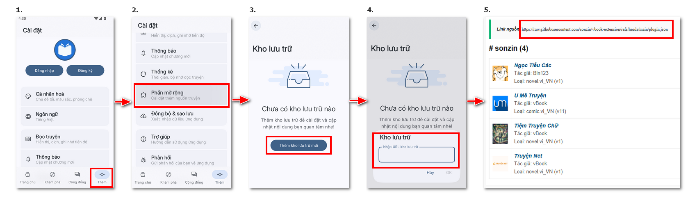
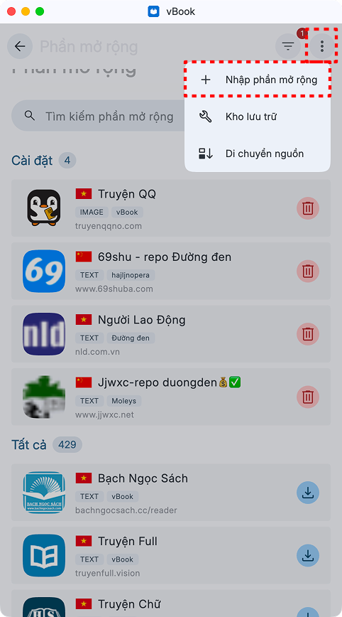
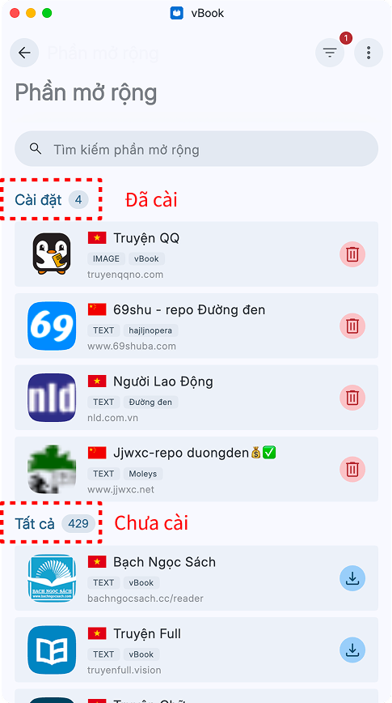
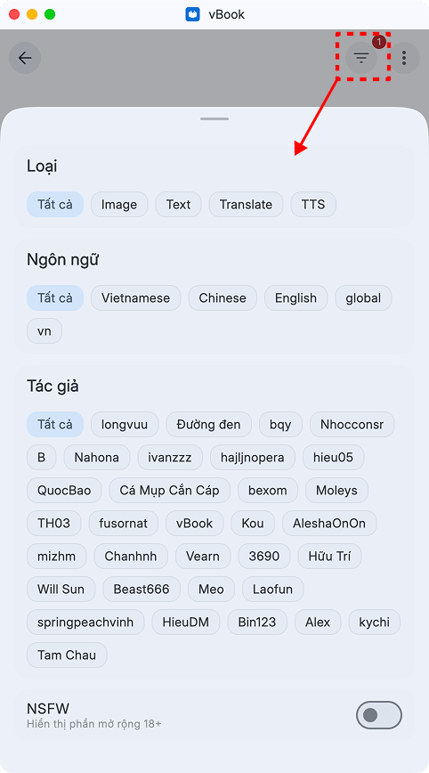

# Cài nguồn bản beta

📲 Hướng dẫn thêm nguồn truyện

* 1️⃣ Vào **︙ -> Phần mở rộng -> Thêm kho lưu trữ -> Copy URL từ link nguồn -> Dán vào Kho lưu trữ**

<figure><figcaption></figcaption></figure>

* 2️⃣ Quay về và cài đặt ext

#### Thêm nguồn từ file zip

* **︙ -> Phần mở rộng -> Nhập phần mở rộng**&#x20;

<figure><figcaption></figcaption></figure> <figure><figcaption></figcaption></figure> <figure><figcaption></figcaption></figure>

