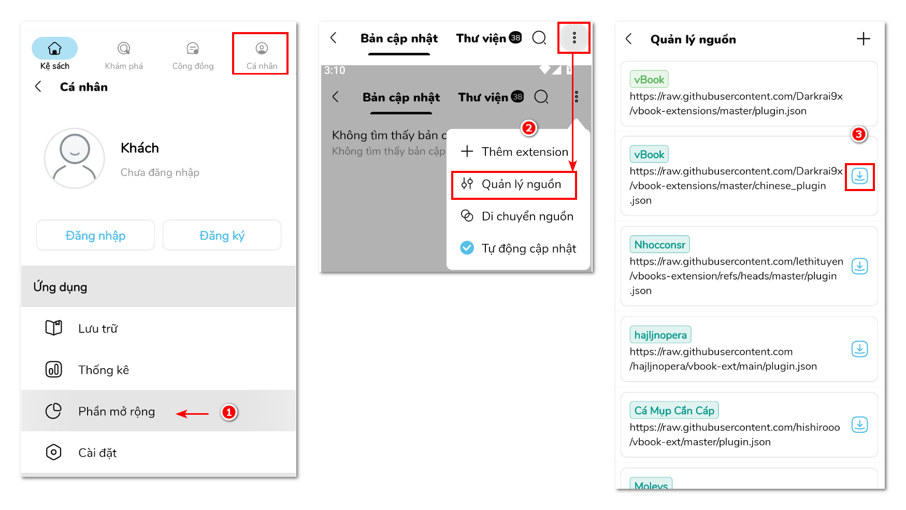
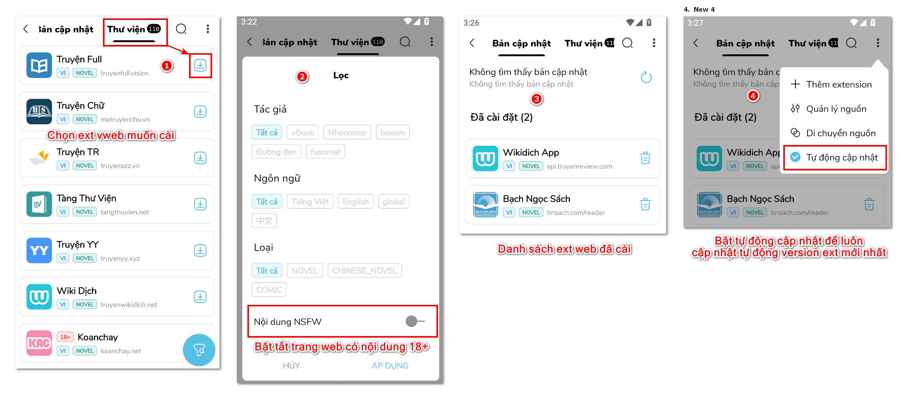

# Cài nguồn bản thường

* Vào **Cá nhân -> Phần mở rộng -> (3 chấm) -> Quản lý nguồn** thêm nguồn mình muốn. Hoặc nhấn dấu ✚ để thêm nguồn ngoài danh sách

<figure><figcaption></figcaption></figure>

* Vào **Cá nhân -> Phần mở rộng -> (3 chấm) -> Quản lý nguồn** thêm nguồn mình muốn

<figure><figcaption></figcaption></figure>
