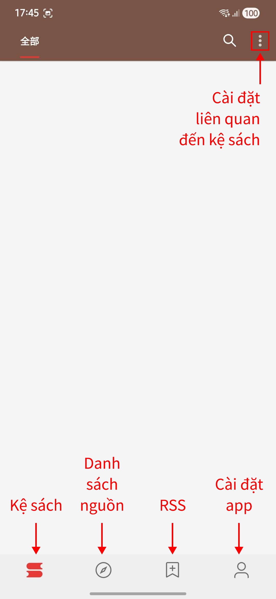
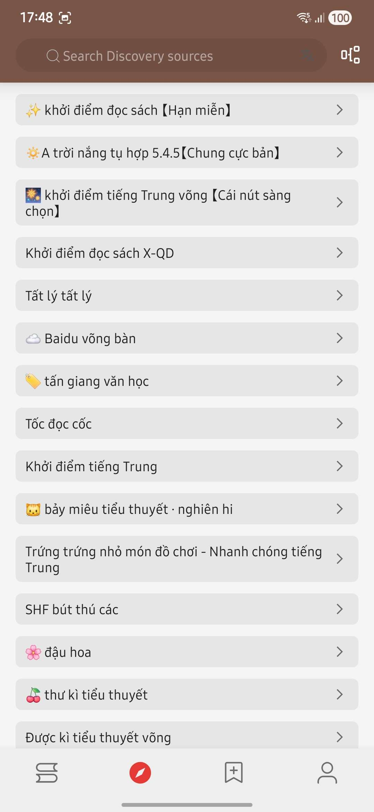
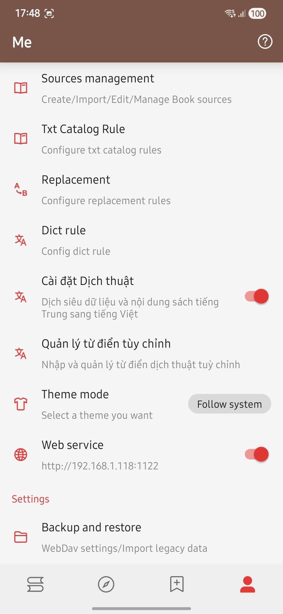
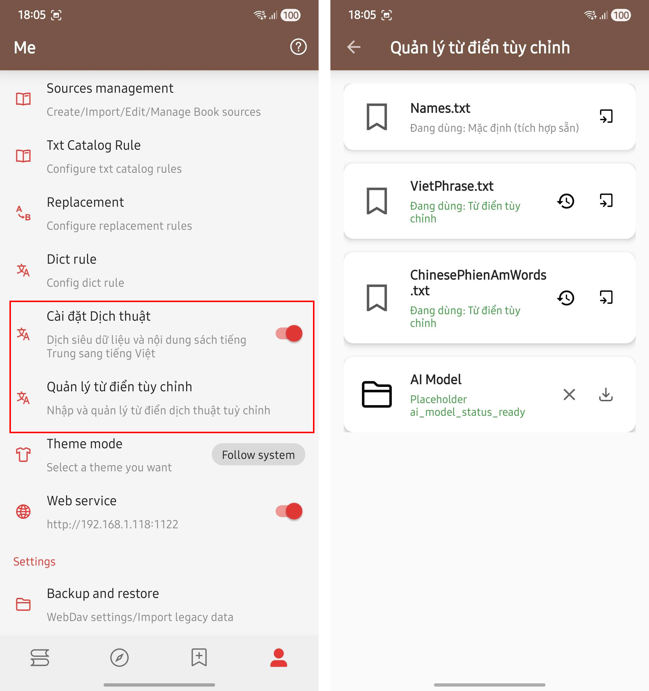
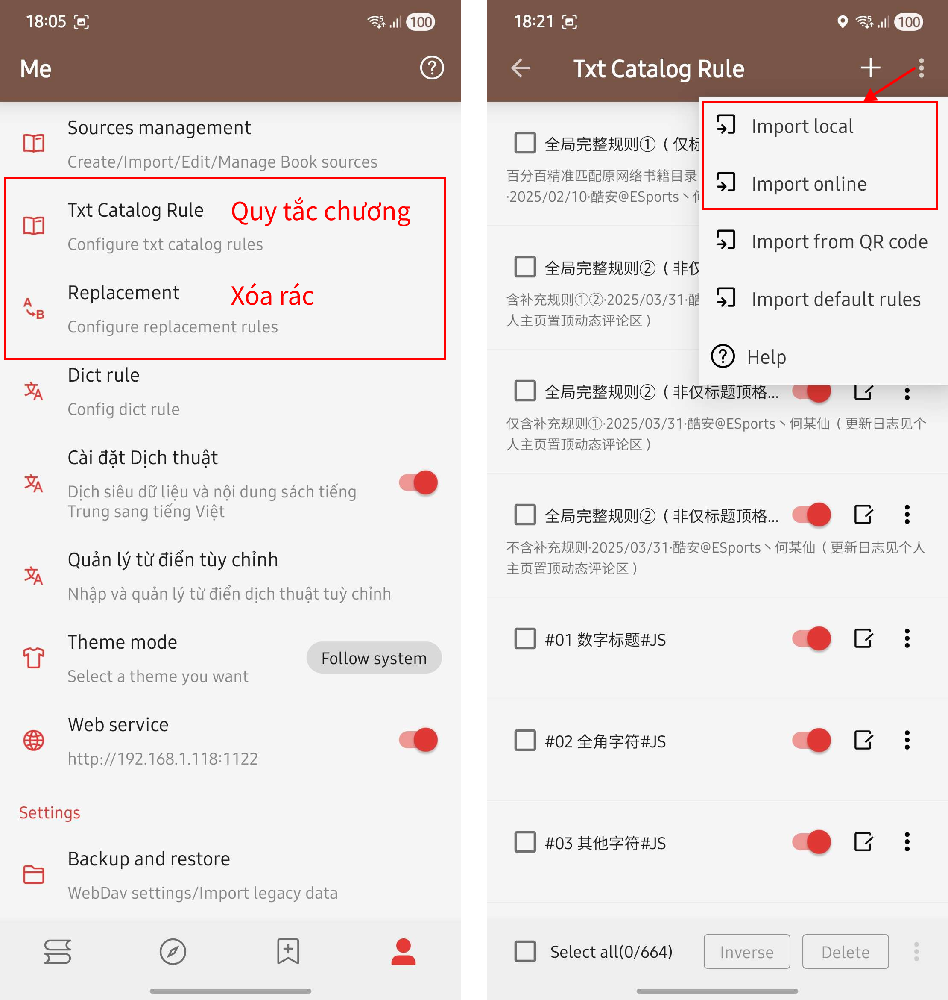
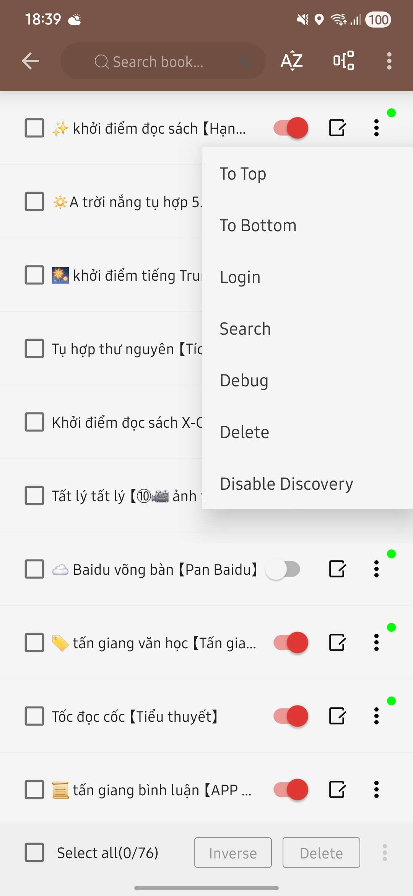

# Legado

## Giới thiệu

1. **Legado là 1 app đọc sách của TQ**, hoạt động giống vbook, sử dụng extension để get truyện về kệ sách.
2. Chỉ có trên Android
3. Link tải app gốc: [**`https://github.com/Luoyacheng/legado/releases/tag/3.26.030717`**](https://github.com/Luoyacheng/legado/releases/tag/3.26.030717)
4. Link tải app đã Việt hóa với data Vietphrase: [**`https://github.com/dat-bi/legado-qt/releases`**](https://github.com/dat-bi/legado-qt/releases)
5. Và web nào đã banned ip Việt Nam, đã die hay bật cloudfare..., vbook ko đọc được thì Legado cũng ko được. Web nào yêu cầu đăng nhập, mua VIP, trả tiền thì vẫn phải trả, nhá!!!!&#x20;
6. Ngôn ngữ mặc định khi cài Legado dựa trên ngôn ngữ của thiết bị. Nếu muốn chuyển app sang tiếng Việt thì ngôn ngữ của thiết bị phải là tiếng Việt

## Hướng dẫn với bản Việt hóa

<figure><figcaption></figcaption></figure> <figure><figcaption></figcaption></figure> <figure><figcaption></figcaption></figure>

1. Bắt đầu tại phần cài đặt app
2. Nhập từ điển Vietphrase

<figure><figcaption></figcaption></figure>

<figure><figcaption></figcaption></figure>

5. Cài nguồn, tương tự như việc cài ext của vbook
   1. Link tổng hợp và tìm kiếm ext: [**`https://www.yckceo.com/yuedu/shuyuan/index.html`**](https://www.yckceo.com/yuedu/shuyuan/index.html)
   2.  Đọc kỹ hướng dẫn cài đặt của ext nếu có\
       Ví dụ:&#x20;

       <figure><figcaption></figcaption></figure>
   3.  Nhập qua file (Import local) hoặc Nhập qua link (Import online)

       <figure><figcaption></figcaption></figure>
   4.  Cài xong trông sẽ như thế này

       <figure><figcaption></figcaption></figure>
6.  **Tìm sách:** có 2 cách

    1. **Từ kệ sách:** Gõ từ khóa vào ô tìm kiếm\
       Những thứ cần chú ý
       1. **Precise Search:** mặc định là Tắt. Khi bật lên thì nó sẽ chỉ trả về kết quả nếu khớp toàn bộ.\
          Ví dụ: bạn tìm "Vạn cổ thần đế".\
          Nếu tắt tính năng này, kết quả trả về chỉ cần khớp 1 trong 4 chữ là được tính đúng.\
          Nếu bật, sẽ chỉ cho ra kết quả khi toàn bộ 4 chữ "Vạn cổ thần đế" khớp
       2. **Multi-group/ Book source:** Tìm theo nhóm bạn chỉ định
    2. Chỉ tìm trong nguồn mà bạn muốn:\
       **User > Sources Management > chọn nguồn bạn muốn tìm > nhấn ⋮ > Search**
    3. Nguồn yêu cầu đăng nhập thì sẽ có thêm lựa chọn **Login**

    <figure><figcaption></figcaption></figure>

    <figure><figcaption></figcaption></figure>

    <figure><figcaption></figcaption></figure>
7. Thêm sách vào kệ

<figure><figcaption></figcaption></figure>

8. **Cài ext legado và bật Web services** để có thể đọc bằng vbook\
   • ko tắt app Legado trong quá trình sử dụng\
   • Ext legado **chỉ hiển thị sách trong kệ sách của App Legado**, ko thể tìm kiếm trực tiếp trên vbook\
   • Tắt DNS của vbook

<figure><figcaption></figcaption></figure> <figure><figcaption></figcaption></figure>

Link: [**Danh sách nguồn**](danh-sach-nguon.md#nguon-ext-dich)
