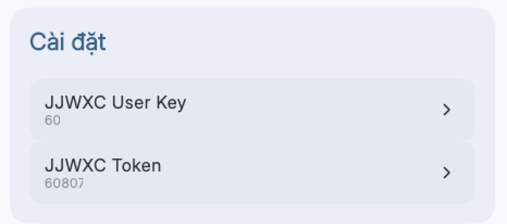

# Tấn giang JJWXC


Hướng dẫn này chỉ áp dụng cho bạn đọc có tài khoản Tấn Giang và đã mua chương vip của truyện, cần đăng nhập để đọc chương đã mua trên Vbook\
Bạn không cần đăng nhập trên web của Tấn Giang - jjwxc.net để sử dụng extension. Thay vào đó sẽ sử dụng đăng nhập trên app Tấn Giang - token. Nói đơn giản thì token = nick Tấn Giang của bạn.\
**CHỈ CẦN LẤY 1 TOKEN LÀ CÓ THỂ ĐỌC ĐƯỢC TRÊN NHIỀU THIẾT BỊ**\
**Nếu bạn lấy token mới thì hiện tại sẽ die**

Trường hợp nhiều người dùng thì chỉ cần chia sẻ token thôi, là có thể cùng nhau đọc.\
<mark style="color:$danger;">**Chỉ chia sẻ token cho những người bạn tin tưởng, không chia sẻ token công khai.**</mark>\
Thắc mắc, cần hỗ trợ thì bình luận nhé.


## Lấy token (Android)

1. Tải app lấy token [**tại đây**](../ho-tro/cong-cu.md)
2. Tải app Tấn Giang trên điện thoại: [**Link**](https://m.jjwxc.net/download/android)
3. Đăng nhập app Tấn Giang
4.  Mở app lấy token, nhấn start

    
<figure><figcaption>
Reqable
</figcaption></figure> <figure><figcaption>
NetCapture
</figcaption></figure>

5. Quay về app Tấn Giang, mở truyện, mở chương vip, thực hiện mua chương, tắt app
6. Quay về app lấy token, nhấn <mark style="color:$warning;">**Stop**</mark>, nhấn <mark style="color:$warning;">**⋮**</mark> góc trên bên phải, nhấn **Search**, tìm và copy <mark style="color:$warning;">**token**</mark>

<figure><figcaption>
ví dụ bước 4-5 với app Reqable
</figcaption></figure> <figure><figcaption>
ví dụ bước 6 với app Reqable
</figcaption></figure> <figure><figcaption>
ví dụ bước 6 với app Reqable
</figcaption></figure>

7. Cài ext Tấn Giang - Đọc [Danh sách nguồn](danh-sach-nguon.md), chỉ cẩn cài 1 trong 3 ext hiện có là được
8.  Nhập token vào ô Mã bổ sung

    Đọc [Mở cài đặt riêng cho một nguồn](../ho-tro/mot-so-cai-dat-khac.md#mo-cai-dat-rieng-cho-mot-nguon)

<figure><figcaption>
Ext Tấn Giang
</figcaption></figure>

<figure><figcaption></figcaption></figure>

#### <mark style="color:$danger;">**Lưu ý:**</mark>

1\. vbook bản cũ: <mark style="color:$warning;">**`let token = "token của bạn"`**</mark>&#x20;

2\. vbook bản beta:&#x20;

* Chỉ cần <mark style="color:$warning;">**dán token của bạn vào ô JJWXC\_TOKEN**</mark>

<figure><figcaption>
ví dụ nhập token cho bản beta
</figcaption></figure>

3. Nếu token bị hết hạn hoặc bị lộ token thì hãy logout app Tấn Giang, sau đó login lại để lấy token mới
4. Trong tương lai có thể sẽ cần nhập thêm <mark style="color:$danger;">**JJWXC User Key**</mark>
   1. Bản thường: <mark style="color:$warning;">**let jjwxcUserKey = 'user \_key của bạn';**</mark>
   2.  Bản beta:&#x20;

       <figure><figcaption></figcaption></figure>

<figure><figcaption></figcaption></figure>

Video hướng dẫn với **app NetCapture**


