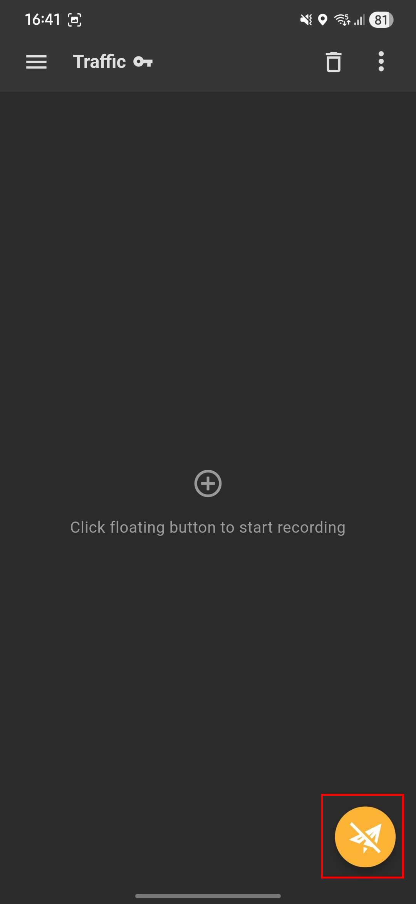
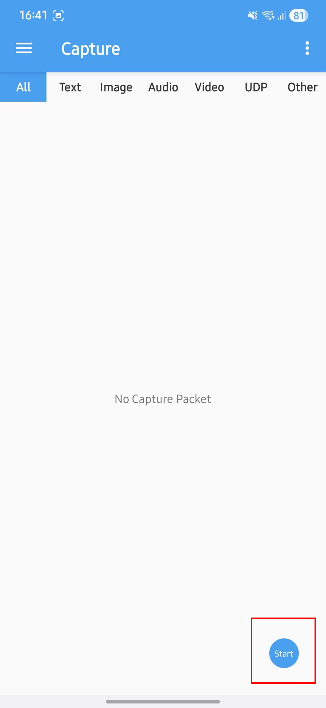
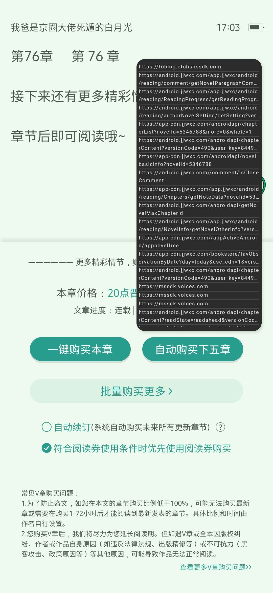
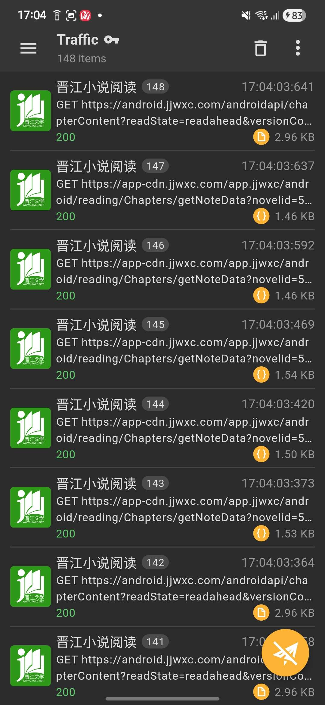
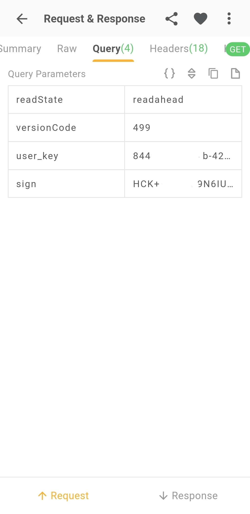

# Tấn giang JJWXC


Hướng dẫn này chỉ áp dụng cho bạn đọc có tài khoản Tấn Giang và đã mua chương vip của truyện, cần đăng nhập để đọc chương đã mua trên Vbook\
Bạn không cần đăng nhập trên web của Tấn Giang - jjwxc.net để sử dụng extension. Thay vào đó sẽ sử dụng đăng nhập trên app Tấn Giang - token. Nói đơn giản thì token = nick Tấn Giang của bạn.\
**CHỈ CẦN LẤY 1 TOKEN/SIGN LÀ CÓ THỂ ĐỌC ĐƯỢC TRÊN NHIỀU THIẾT BỊ**\
**Nếu bạn lấy token mới thì hiện tại sẽ die**

Trường hợp nhiều người dùng thì chỉ cần chia sẻ token thôi, là có thể cùng nhau đọc.\
<mark style="color:$danger;">**Chỉ chia sẻ token cho những người bạn tin tưởng, không chia sẻ token công khai.**</mark>\
Thắc mắc, cần hỗ trợ thì bình luận nhé.


## Lấy token (Android)

1. Tải app lấy **token/sign** và **user\_key** [**tại đây**](../ho-tro/cong-cu.md)
2. Tải app Tấn Giang trên điện thoại: [**Link**](https://m.jjwxc.net/download/android)
3. Đăng nhập app Tấn Giang
4.  Mở app lấy **token/sign**, nhấn start


    <div><figure><figcaption><p>Reqable</p></figcaption></figure> <figure><figcaption><p>NetCapture</p></figcaption></figure></div>
5. Quay về app Tấn Giang, mở truyện, mở chương vip, thực hiện mua chương, tắt app
6. Quay về app lấy token/sign, nhấn <mark style="color:$warning;">**Stop**</mark>, nhấn <mark style="color:$warning;">**⋮**</mark> góc trên bên phải, nhấn **Search**, tìm và copy <mark style="color:$warning;">**token**</mark>

<div><figure><figcaption><p>ví dụ bước 4-5 với app Reqable</p></figcaption></figure> <figure><figcaption><p>ví dụ bước 6 với app Reqable</p></figcaption></figure> <figure><figcaption><p>ví dụ bước 6 với app Reqable</p></figcaption></figure></div>

7.

    <figure><figcaption><p>Copy user key và sign</p></figcaption></figure>


8. Cài <mark style="color:blue;">**ext Tấn Giang của QuocBao**</mark>- Đọc [Danh sách nguồn](danh-sach-nguon.md)
9.  Nhập <mark style="color:$danger;">**user key và sign**</mark> vào ô Mã bổ sung

    Đọc [Mở cài đặt riêng cho một nguồn](../truyen-chu/mot-so-cai-dat-khac.md#mo-cai-dat-rieng-cho-mot-nguon)

<figure><figcaption><p>Ext Tấn Giang</p></figcaption></figure>

<figure><figcaption><p>vbook bản beta:chỉ cần nhập trực tiếp user key và sign</p></figcaption></figure>

#### <mark style="color:$danger;">**Lưu ý:**</mark>

1\. Đối với **vbook bản cũ**: cần nhập 2 giá trị sau vào mã bổ sung

```
let token = 'sign=<chuỗi sign>'; 
let jjwxcUserKey = 'user _key của bạn';
```

2\. Đối với **vbook bản beta:** Chỉ cần <mark style="color:$warning;">**dán sign và user key của bạn vào**</mark>

3. Nếu token bị hết hạn hoặc bị lộ token thì hãy logout app Tấn Giang, sau đó login lại để lấy <mark style="color:$danger;">**sign  mới và user\_key mới**</mark>

Video hướng dẫn với **app NetCapture**


