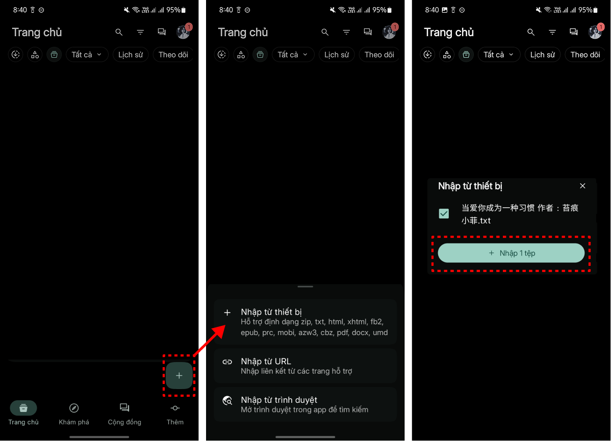
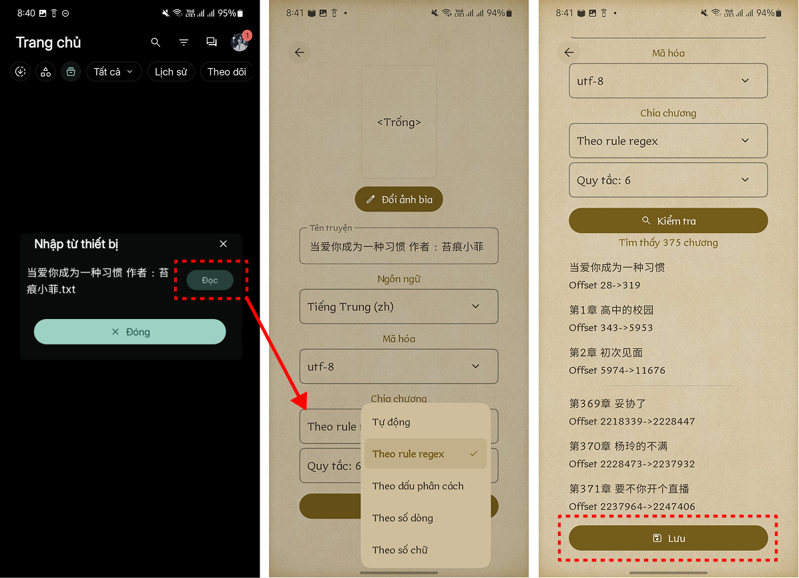

# Dịch từ file

## Bản thường

<figure><figcaption></figcaption></figure>


[<mark style="color:$danger;">Bản này không hỗ trợ xuất file từ file</mark>](#user-content-fn-1)[^1]


## Bản beta

<figure><figcaption></figcaption></figure>

<figure><figcaption></figcaption></figure>


<mark style="color:$danger;">Bản này hỗ trợ xuất file từ file</mark>


[^1]: 
