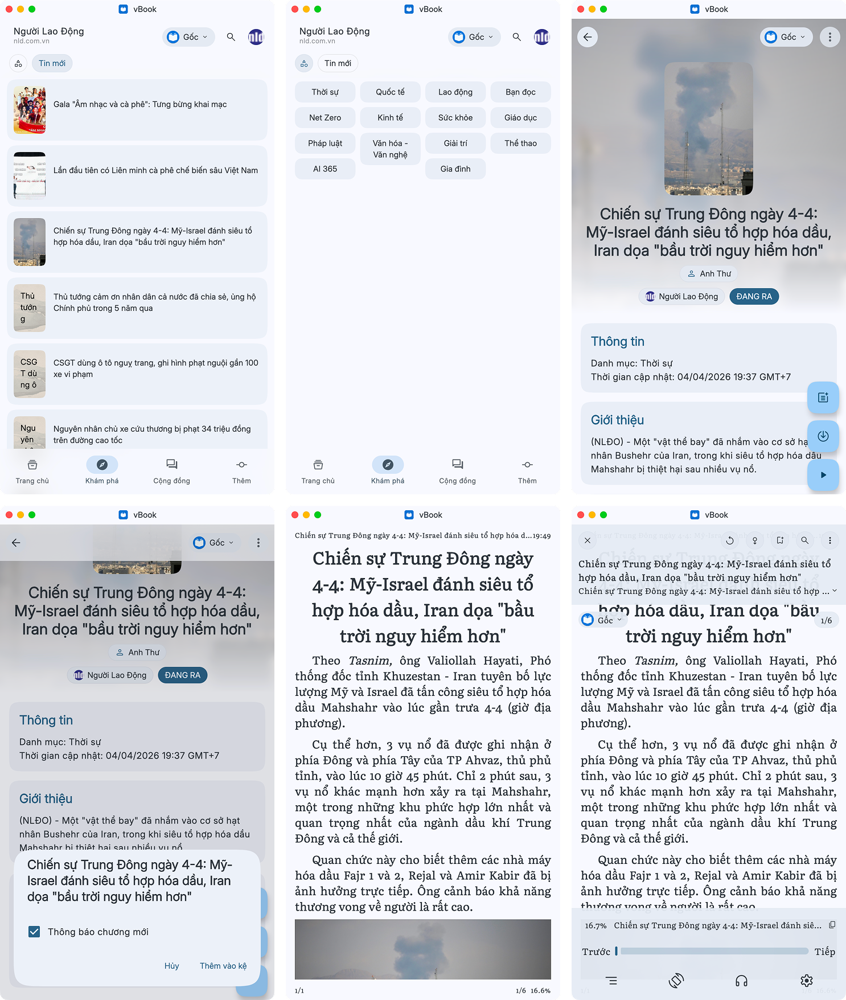
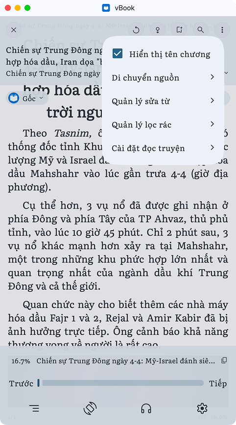
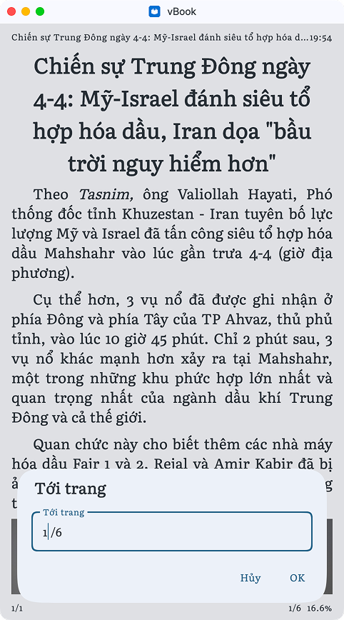
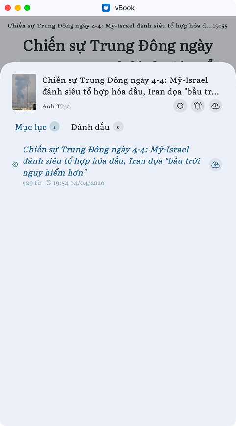
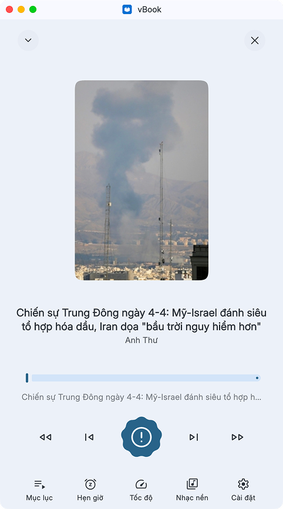
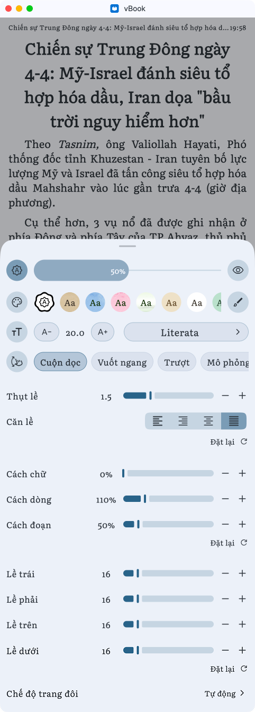

# Giao diện chung

<figure><figcaption></figcaption></figure>

<figure><figcaption></figcaption></figure>

1.  Từ trái qua phải:

    1. Tải lại chương
    2. Tự động cuộn trang
    3. Đánh dấu trang
    4. Tìm kiếm
    5. Mở cài đặt

    <figure><figcaption></figcaption></figure>
2. Mở mục lục
3.  Cài đặt dịch

4.  Số trang trong một chương: bấm vào có thể chọn nhanh số trang

    <figure><figcaption></figcaption></figure>
5. Từ trái qua phải:
   1. Tiến độ đọc
   2. Tiêu đề chương
   3. Copy nội dung chương
6. Từ trái qua phải:
   1. Nhảy tới chương trước
   2. Thanh tiến độ
   3. Nhảy tới chương sau
7.  Từ trái qua phải:

    1.  Mở mục lục

        <figure><figcaption></figcaption></figure>
    2. Xoay màn hình
    3.  Bật nghe truyện

        <figure><figcaption></figcaption></figure>
    4. Mở cài đặt

    <figure><figcaption></figcaption></figure>
