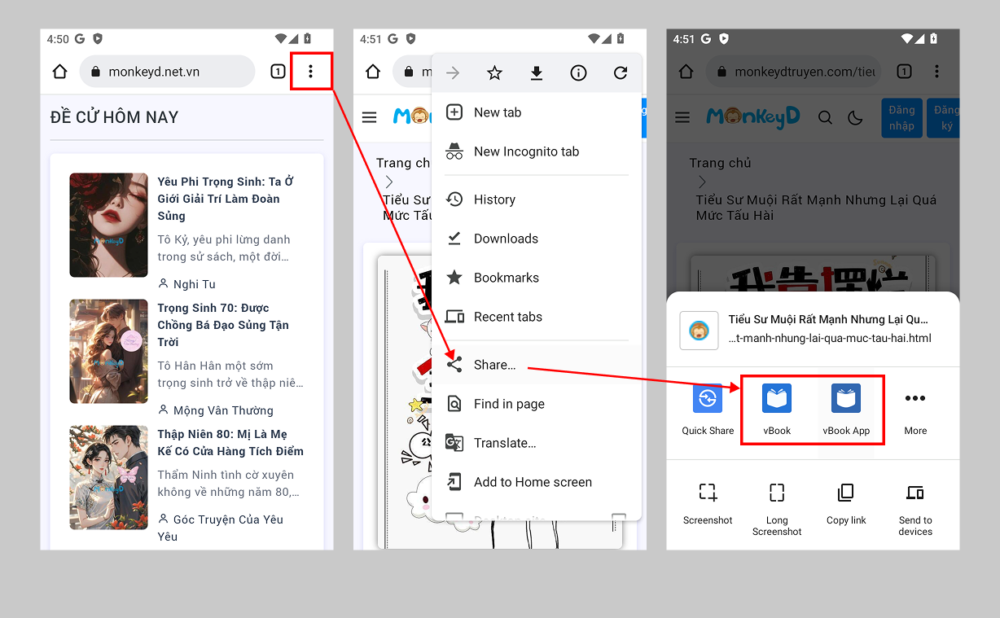
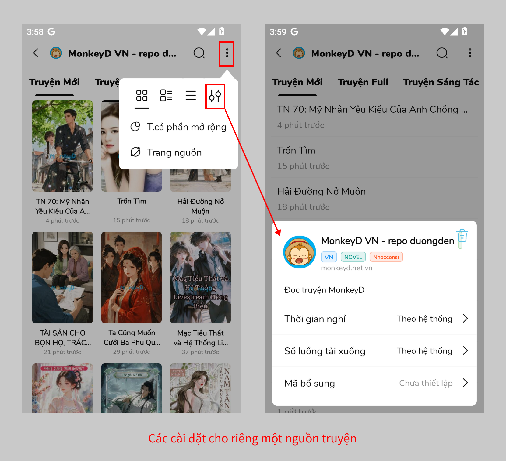
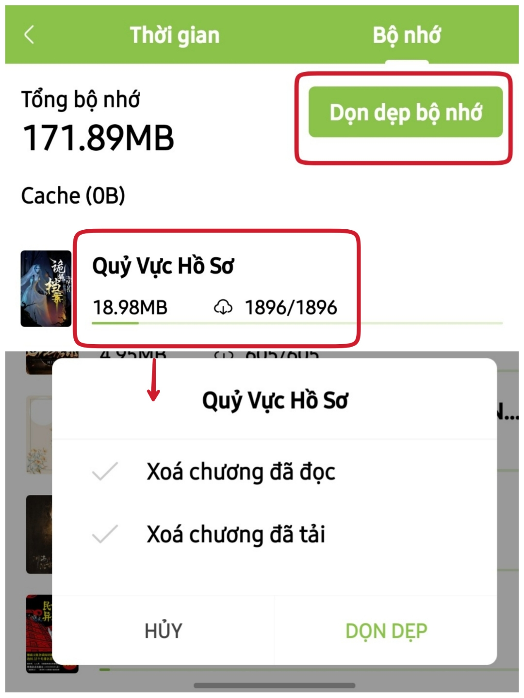

# Một số kiến thức khác

## Thêm truyện từ trình duyệt

<figure><figcaption></figcaption></figure>

## Thêm truyện từ trang nguồn

<figure><figcaption>
Bản thường
</figcaption></figure>

<figure><figcaption>
Bản beta
</figcaption></figure>

## Mở cài đặt riêng cho một nguồn

<figure><figcaption>
Bản thường
</figcaption></figure>

<figure><figcaption>
Bãn beta
</figcaption></figure>

## Xóa cache/nội dung chương đã tải/đã đọc (bản thường

Vào Cá nhân > Thống kê > Bộ nhớ : Bấm dọn dẹp bộ nhớ để xóa cache toàn kệ sách hoặc bấm vào từng truyện để xóa cache cho truyện mình chọn

<figure><figcaption></figcaption></figure>

## Sửa tên truyện nguồn Việt

1.  Đánh dấu từ cần sửa, chọn Sửa tên

    <figure><figcaption>
Bản thường
</figcaption></figure>

    <figure><figcaption>
Bản beta
</figcaption></figure>
2. Thêm vào Name chung: tức là sẽ áp dụng thay đổi cho tất cả các truyện trong kệ sách
   *   **Cc (bản thường) Aa (bản beta):** là chức năng sửa sẽ áp dụng cho cả chữ viết hoa lẫn viết thường.

       Ví dụ: sửa "Bệnh Viện" thành "bệnh viện"
   * Khi không chọn **Cc/Aa**: chỉ sửa đúng cụm "Bệnh Viện" thành "bệnh viện". Các cụm viết "Bệnh viện" hay "bệnh Viện" sẽ không thay đổi.
   * Khi chọn **Cc/Aa**: tất cả các cụm "Bệnh Viện", "Bệnh viện" hay "bệnh Viện" sẽ được thay đổi thành "bệnh viện"

