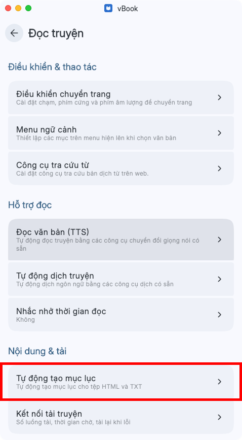

# Rule mục lục của vbook


#### <mark style="color:$danger;">**Chỉ dành cho bản beta**</mark>


<figure><figcaption></figcaption></figure>

### 1. 目录(去空白)


```
(?<=[　\s])
(?:序章|楔子|正文(?!完|结)|终章|后记|尾声|番外|
第\s{0,4}[数字]+?\s{0,4}(?:章|节|卷|集))
.{0,30}$
```


**Ý nghĩa:** Match tiêu đề chương nếu phía trước có khoảng trắng

**Ví dụ match**


```
　　第1章 开始
```


**Ví dụ&#x20;**<mark style="color:$warning;">**không**</mark>**&#x20;match**


```
第一节课 数学
```


### 2. 目录


```
^[ 　\t]{0,4}
(?:序章|楔子|正文|终章|后记|尾声|番外|
第xxx章)
.{0,30}$
```


**Ý nghĩa:** Rule tiêu chuẩn nhận diện mục lục chương

**Ví dụ match**


```
第1章 开始
第一章 重生
番外 婚后日常
序章
```


**Ví dụ&#x20;**<mark style="color:$warning;">**không**</mark>**&#x20;match**


```
今天是第一章内容
```


...
