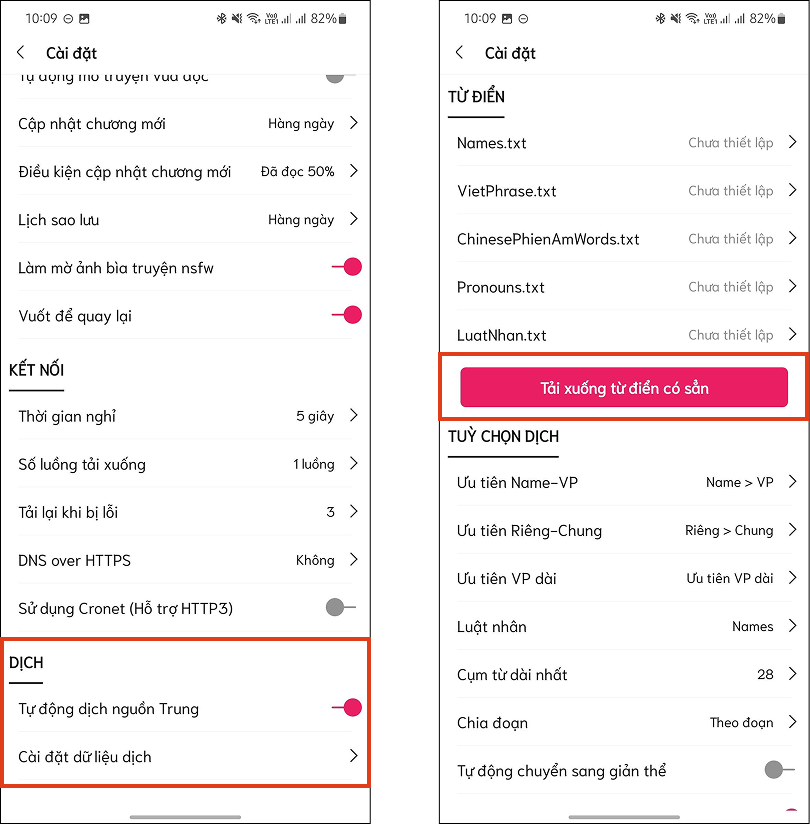
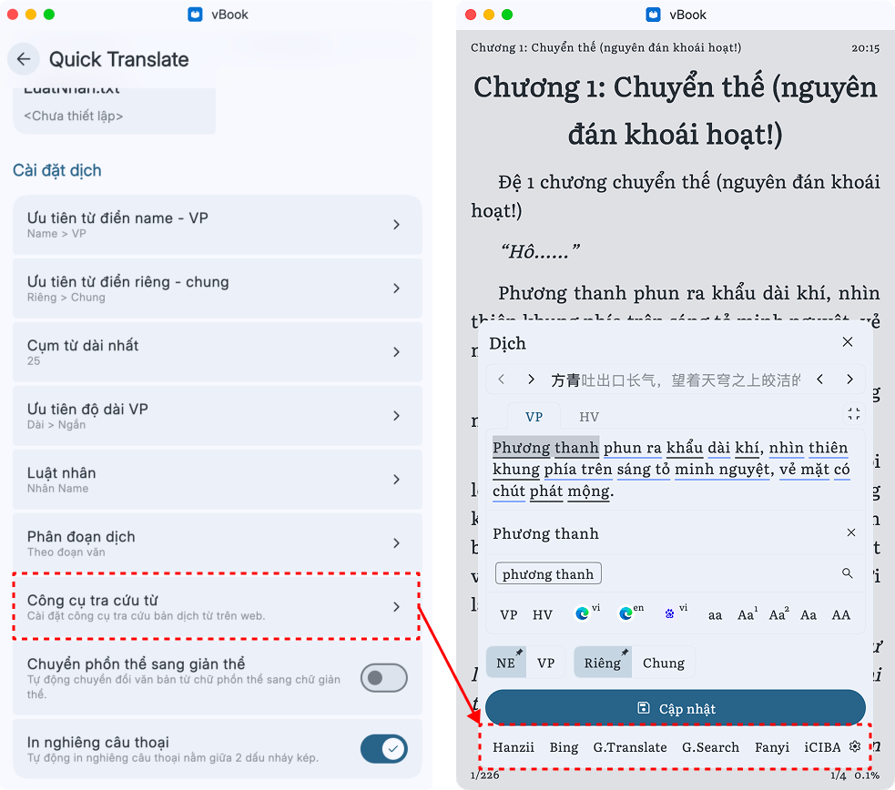
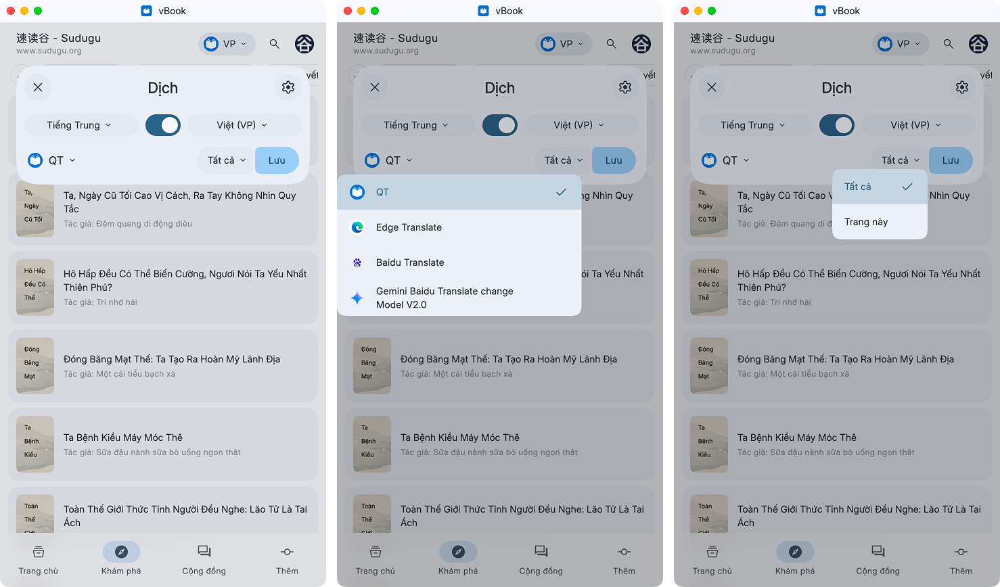
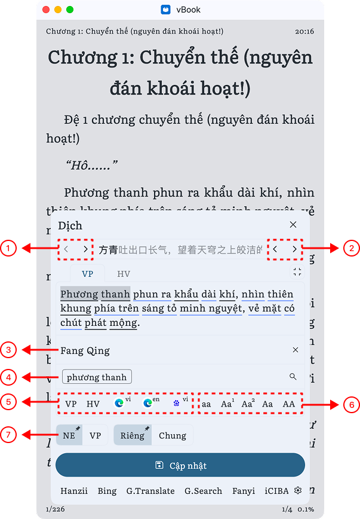
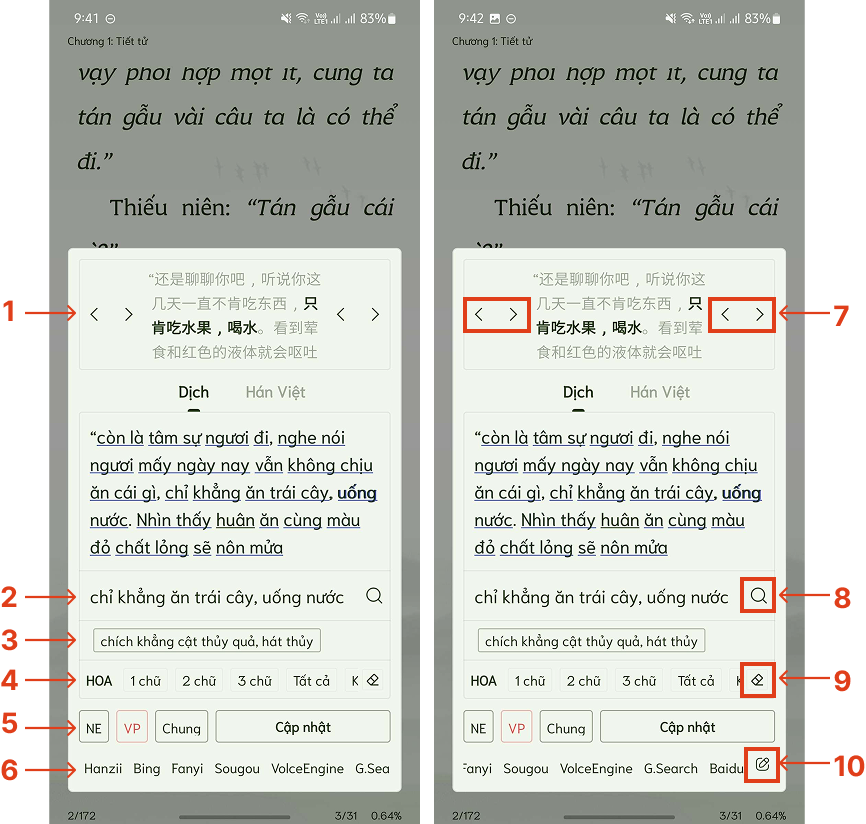

# Truyện dịch



### Cài đặt dịch:&#x20;

Các dữ liệu dịch nằm trong phần này sẽ ảnh hưởng đến toàn bộ app, bao gồm Kệ sách, Khám phá, Trang nguồn



<figure><figcaption></figcaption></figure>



<figure><figcaption></figcaption></figure>





### Cài nguồn dịch

1. **Dịch bằng Edge translate hoặc Google translate:** [Nguồn khác](../nguon-mo-rong/danh-sach-nguon.md#nguon-ext-dich)
2. **Dịch bằng vietphrase:** Cài data từ điển trong phần Quick translate. <mark style="color:$warning;">**Các file Vietphrase, Phiên âm và Pronouns bắt buộc phải có**</mark>**.** Có thể sử dụng từ điển mặc định hoặc sử dụng từ điển khác

Link:&#x20;

* **Trà sữa (duongden)**
  * [Vietphrase Basic](https://drive.google.com/drive/folders/1sZrmJYPV6Jw69w31dG2NyY6S8SYnbrX4?usp=sharing)
* **MrBeo**
  * [Vietpharse (tổng hợp)](https://drive.google.com/drive/folders/11--Bvg_d3sE_K2G4RwbAPt_fKZv0SHrl)
* **MrTeo**
  * [Vietpharse](https://moldich.gq/vpmrteo.php)

3. **Công cụ tra cứu từ của Quick translate**

<figure><figcaption></figcaption></figure>

Các công cụ tra cứu từ khác:

1. **Moldich:** `https://moldich.gq/?q=%s`
2. **Bing:** `https://www.bing.com/translator?sl=zh-CN&tl=en&text=%s`
3. **Fanyi:** `https://fanyi.baidu.com/#zh/vie/%s`
4. **Moldich:** `https://moldich.gq/?q=%s`
5. **Sogou:** `https://fanyi.sogou.com/text?zh=default&keyword=%s&transfrom=zh-CHS&transto=vi&model=general`



### Bật dịch

Chọn ngôn ngữ dịch > Chọn nguồn dịch > Chọn dịch trang hiện hành hoặc tất cả các trang > Lưu

<figure><figcaption></figcaption></figure>



### Giao diện dịch



<figure><figcaption></figcaption></figure>

1. Mở rộng / Bỏ bớt cụm từ về hai bên trái
2. Mở rộng / Bỏ bớt cụm từ về hai bên phải
3. Khung nội dung đang sửa
4. Chọn nghĩa cho từ/cụm từ đang được chọn, nội dung ở vị trí số 3 sẽ đổi theo. Nghĩa được hiển thị tại mục này bao gồm nghĩa gốc Hán Việt và nghĩa khác (nếu có) của từ/cụm từ đó trong file Vietphrase.
5. Dịch theo: VP (Vietphrase), HV (Hán Việt), Bing, Google... (cần cài [**ext translate**](../nguon-mo-rong/danh-sach-nguon.md#nguon-ext-dich))
6. Tùy chọn viết hoa cho từ/cụm từ đang được chọn.
7. **NE: Name** - sửa tên. **VP: Vietphrase** - sửa từ/cụm từ không thuộc tên. **Nhấn giữ để thay đổi cài đặt dịch** mặc định là **NE** hay **VP**, **Riêng** hay **Chung**
   1. Riêng: Chỉ áp dụng cho truyện đang đọc
   2. Chung: Thay đổi áp dụng cho các truyện còn lại trong kệ sách



<figure><figcaption></figcaption></figure>

1. Đoạn văn gốc tiếng Trung, cụm in đậm là cụm muốn sửa. Nếu nhấn giữ đè lên cụm in đậm thì có thể copy từ/cụm từ cần dịch
2. Nội dung đang sửa.
3. Chọn nghĩa cho từ/cụm từ đang được chọn, nội dung ở vị trí số 3 sẽ đổi theo. Nghĩa được hiển thị tại mục này bao gồm nghĩa gốc Hán Việt và nghĩa khác (nếu có) của từ/cụm từ đó trong file Vietphrase.
4. Tùy chọn viết hoa chữ cái đầu cho từ/cụm từ đang được chọn.
5. **NE: Name** - sửa tên. **VP: Vietphrase** - sửa từ/cụm từ không thuộc tên. Mặc định sẽ **lưu vào từ điển Riêng,** **chọn Chung sẽ lưu vào từ điển Chung. Nhấn giữ để lưu cài đặt dịch mặc định**
6. Tra cứu nghĩa của từ/cụm từ đã chọn.
7. Mở rộng/Bỏ bớt cụm từ về hai bên trái/phải.
8. Tra cứu từ/cụm từ cần dịch. Hiện tại bản thường chỉ có một chế độ tra cứu là dùng Google Translate. Nhấn vào nút translate để chuyển đổi qua lại lại tiếng Việt và Anh.&#x20;
9. Bỏ chọn/Reset
10. Các công cụ dịch. Trượt sang trái để hiển thị nút thêm vào các công cụ dịch khác. Một số công cụ dịch khác: **Xem lại bước số 3**




