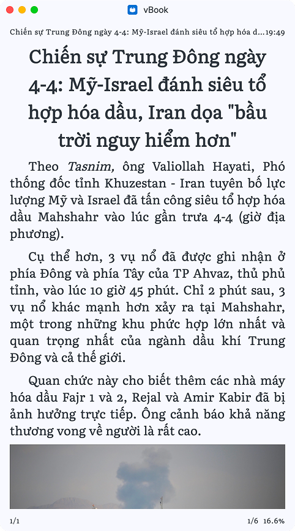
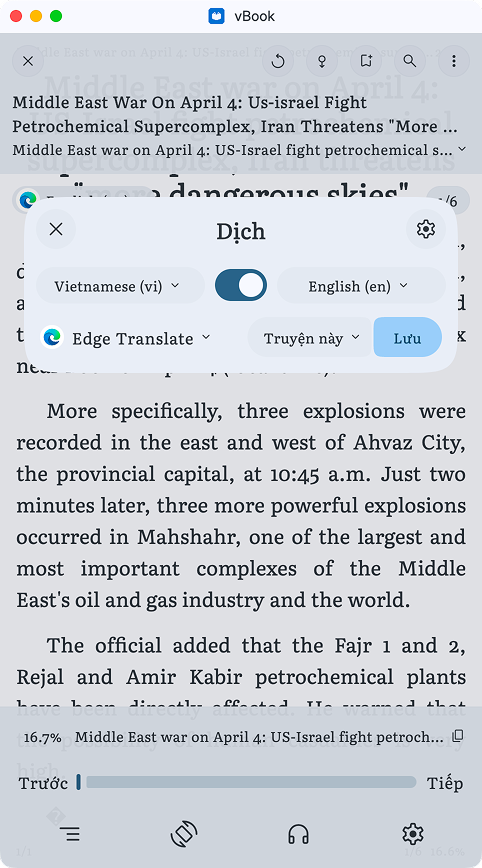

# Truyện Việt

<figure><figcaption></figcaption></figure>

1. Cài đặt nguồn dịch: [Link](../nguon-mo-rong/danh-sach-nguon.md#nguon-ext-dich)
2.  Chọn nguồn dịch, nếu muốn dịch sang ngôn ngữ khác

    <figure><figcaption></figcaption></figure>

Đọc thêm

[Cải đặt giao diện](../giao-dien-app/ban-beta.md#cai-dat-doc-truyen)

[Cài đặt nguồn](../giao-dien-app/ban-beta.md#phan-mo-rong)
